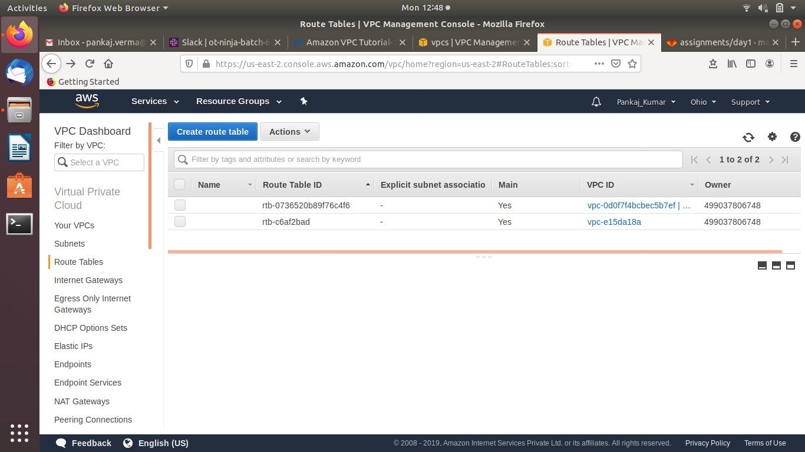

AWS Assignment Day-1


## Task 1

### Create a vpc through wizard, having one public subnet and one private subnet.

```
To create a VPC using the console

1. Open the Amazon VPC console
 
2. In the navigation pane, choose Your VPCs, Create VPC

```


```
3. Specify the VPC details as necessary and choose Create
   
```


```
1. To add a subnet to your VPC using the console

2. In the navigation pane, choose Subnets, Create subnet

3. Specify the subnet details as necessary and choose Create

```


```
Now we have to create an Internet Gateway to make the subnet public.

To create an internet gateway and attach it to your VPC

1. Open the Amazon VPC console

2. In the navigation pane, choose Internet Gateways, and then choose Create internet gateway. 

3. Optionally name your internet gateway, and then choose Create

4. Select the internet gateway that you just created, and then choose Actions, Attach to VPC.

5. Select your VPC from the list, and then choose Attach

```


```
Now Create Route Tables and associate them with your VPC

```



## Task 2

### Create two instances within the vpc that you created in task 1, windows instance in public subnet and linux instance in private subnet. check if linux is pingable from windows and vice versa.

```
To launch an EC2 instance into a VPC

1. Open the Amazon EC2 console

2. In the navigation bar, on the top-right, ensure that you select the same region in which you created your VPC and security group. 

3. From the dashboard, choose Launch Instance.

4. On the first page of the wizard, choose the AMI that you want to use(windows for public and Linux for private ). On the Choose an Instance Type page, you can select the hardware configuration and size of the instance to launch

5. On the Configure Instance Details page, select the VPC that you created from the Network list, and the subnet from the Subnet list. Leave the rest of the default settings, and go through the next pages of the wizard until you get to the Add Tags page

6. On the Add Tags page, you can tag your instance with a Name tag; for example Name=WindowsTest. This helps you to identify your instance in the Amazon EC2 console after you've launched it

7. Now complete Configure Security group and other steps and launch.

```


```
For next part (vice versa) Make public Linux instance and private windows instance.
 (for reaching windows from ping you have to change inbound firewall settings)

```


## Task 3

### Delete all the instances and now make those two instances that you created in previous task using aws-cli.


```
For using aws-cli. install awscli using package manager in your machine and configure it using access key ID and Key. Then Run aws-cli commands
```


```
Provide Tags so that This helps you to identify your instance in the Amazon EC2 console after you've launched it
```


NOTE!

Make Documentation and push to the repo