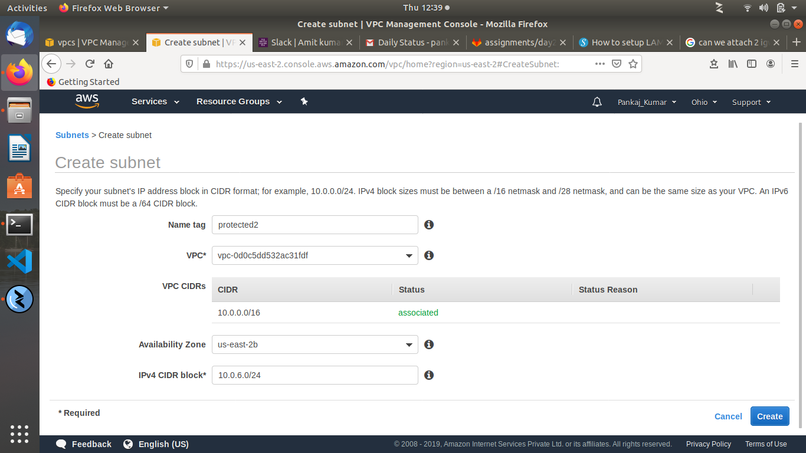
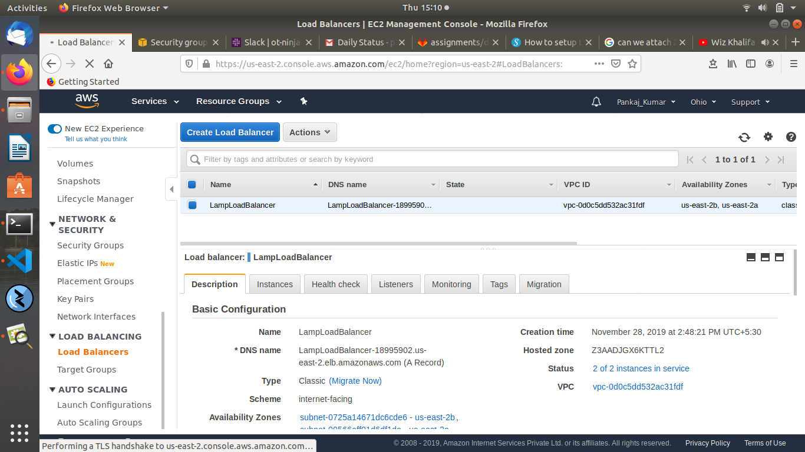
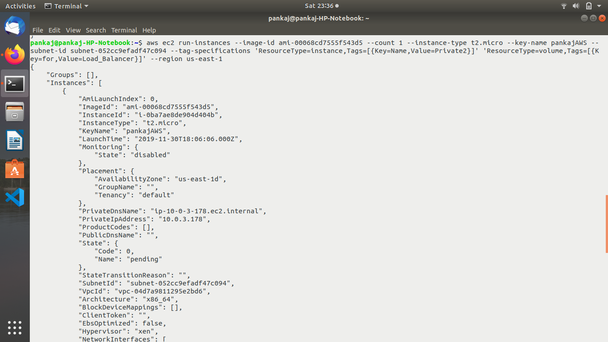
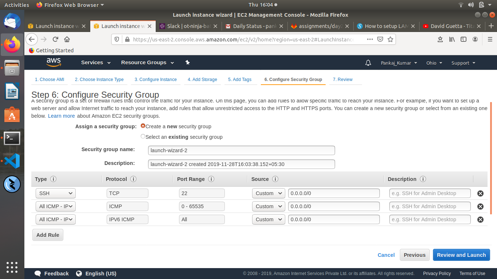
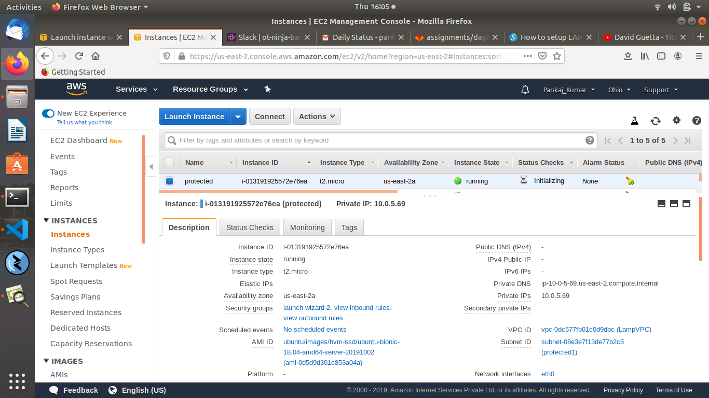

AWS Assignment Day-2


Task 1

Create a vpc not by wizard this time but manually, having 2 public subnets and 2 private subnets and 2 protected subnets.
setup should be highly available

```
To create a VPC using the console

1. Open the Amazon VPC console
 
2. In the navigation pane, choose Your VPCs, Create VPC

```


```
1. To add a subnet to your VPC using the console

2. In the navigation pane, choose Subnets, Create subnet

3. Specify the subnet details as necessary and choose Create

```





Create 1 IGW and 2 NGW in each availability zone and make the appropriate routes in route tables

```
Now we have to create an Internet Gateway to make the subnet public.

To create an internet gateway and attach it to your VPC

1. Open the Amazon VPC console

2. In the navigation pane, choose Internet Gateways, and then choose Create internet gateway. 

3. Optionally name your internet gateway, and then choose Create

4. Select the internet gateway that you just created, and then choose Actions, Attach to VPC.

5. Select your VPC from the list, and then choose Attach

```


```
To create a NAT gateway

1. Open the Amazon VPC console

2. In the navigation pane, choose NAT Gateways, Create NAT Gateway.

3. Specify the subnet in which to create the NAT gateway, and select the allocation ID of an Elastic IP address to associate with the NAT gateway. When you're done, choose Create a NAT Gateway.

4. The NAT gateway displays in the console. After a few moments, its status changes to Available, after which it's ready for you to use.

```


Main route will remain intact, instead make 4 route tables
public_route_table
private_route_table_1
private_route_table_2
protected_route_table

```
To create a custom route table

1. Open the Amazon VPC console

2. In the navigation pane, choose Route Tables.

3. Choose Create route table.

4. For Name tag, you can optionally provide a name for your route table. Doing so creates a tag with a key of Name and a value that you specify. For VPC, choose your VPC, and then choose Create.

```
```
To modify or add a route to a route table

1. Open the Amazon VPC console 

2. In the navigation pane, choose Route Tables, and select the route table.

3. Choose Actions, Edit routes.

4. To add a route, choose Add route. For Destination enter the destination CIDR block or a single IP address.

5. To modify an existing route, for Destination, replace the destination CIDR block or single IP address. For Target, choose a target.

6. Choose Save routes.

```


Task 2

Make LAMP setup with 2 instances in each private subnets.

```
Now we will create 2 instances in both private subnets
```


```
A LAMP Stack is a set of open-source software that can be used to create websites and web applications. LAMP is an acronym: these stacks typically consist of the Linux operating system, the Apache HTTP Server, the MySQL relational database management system, and the PHP programming language.

Now install the same in both instances
```


Server-1 should serve a webpage that would say "Hi! i am server 1"


Server-2 should serve a webpage that would say "Hi! i am server 2"


Task 3

Launch a public load balancer that would forward the requests to these 2 LAMP instances

```
Now we will create a classic load balancer for our 2 Lamp instances and select the VPC and and 2 different availability zones.

1. Open the Amazon EC2 console 

2. On the navigation bar, choose a region for your load balancer. Be sure to select the same region that you selected for your EC2 instances.

3. On the navigation pane, under LOAD BALANCING, choose Load Balancers.

4. Choose Create Load Balancer.

5. For Classic Load Balancer, choose Create

6. Assign security groups to your load balancer

7. Configure health checks

8. Register EC2 instances with your load balancer

Now specify the details as necessary and choose Create.

```




```
Now we will try to access the DNS name and it should balance the load on our 2 instances

It will show "Hi i am server 1" when traffic is redirected to 1st instance
and "Hi i am server 2" when traffic is redirected to 2nd instance

```


create the same setup using aws-cli except vpc


```
As VPC infra is already created we will create 2 instances in private subnet using aws cli

```





```
Now we will create load balancer using aws cli
```


```
Now configure health checks for those our load balancer
```


```
Now setup Lamp server in 2 instances as before and then register instances with load balancer with aws cli
```


NOTE!

Machines in the protected subnets shouldn't be going to internet and vice versa (verify this by launching an instance in this subnet)

```
For verifying protected subnets we will launch an instance in protected subnet and allow icmp ports for ping
```





```
Now we will check if we are able to ping protected instance
```


```
Now we will connect to protected instance through jump server and try to ping a public network
```


Make Documentation and push to the repo
Make sure you copy the actual logs in the documentation rather than assuming that we'll get it We know nothing