AWS Assignment Day-4


Task 1

Lauch 3 instances with the following tags respectively

Name: nginx, boot-order: 1
Name: myapp, boot-order: 2
Name: mydb, boot-order: 3

```
To launch an EC2 instance into a VPC

1. Open the Amazon EC2 console

2. In the navigation bar, on the top-right, ensure that you select the same region in which you created your VPC and security group. 

3. From the dashboard, choose Launch Instance.

4. On the first page of the wizard, choose the AMI that you want to use(windows for public and Linux for private ). On the Choose an Instance Type page, you can select the hardware configuration and size of the instance to launch

5. On the Configure Instance Details page, select the VPC that from the Network list, and the subnet from the Subnet list. Leave the rest of the default settings, and go through the next pages of the wizard until you get to the Add Tags page

6. On the Add Tags page, you can tag your instance with a tags specified in question.

7. Now complete Configure Security group and other steps and launch.

```

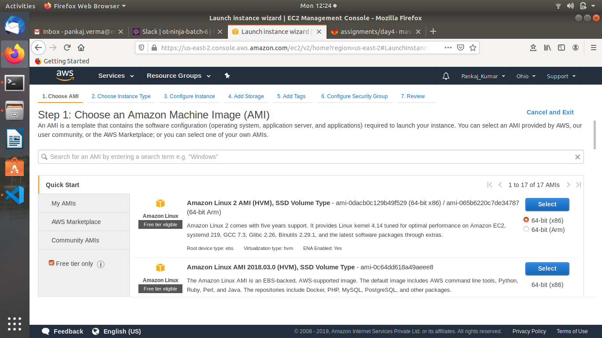

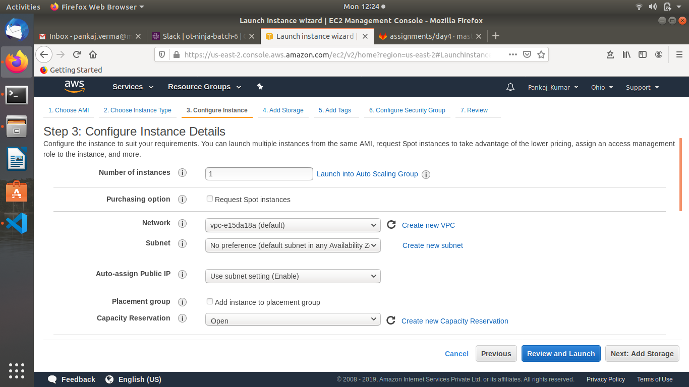


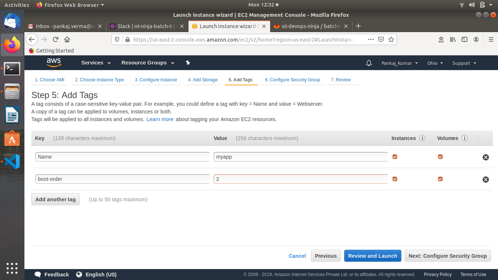


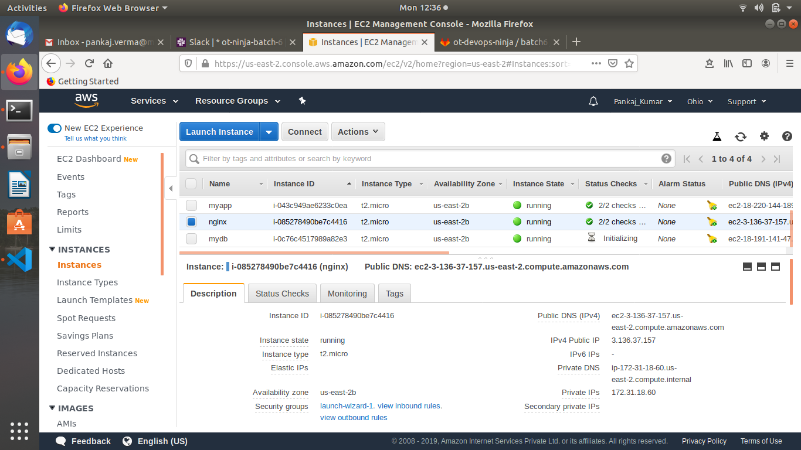


Task 2

write a script that would start/stop these instances in the order you specified, i.e.


instance with boot-order: 3 tag should boot/start first and likewise rest of them
instance with boot-order: 1 tag should stop first and likewise rest of them

```
stoping instances before script
```

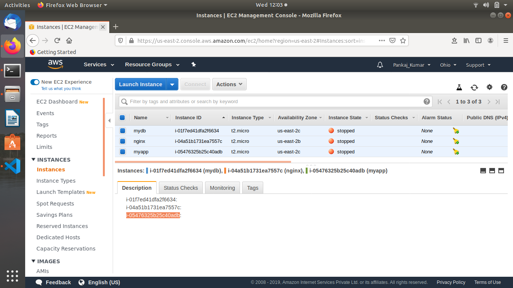

```
script for starting and stopping instances in order
```

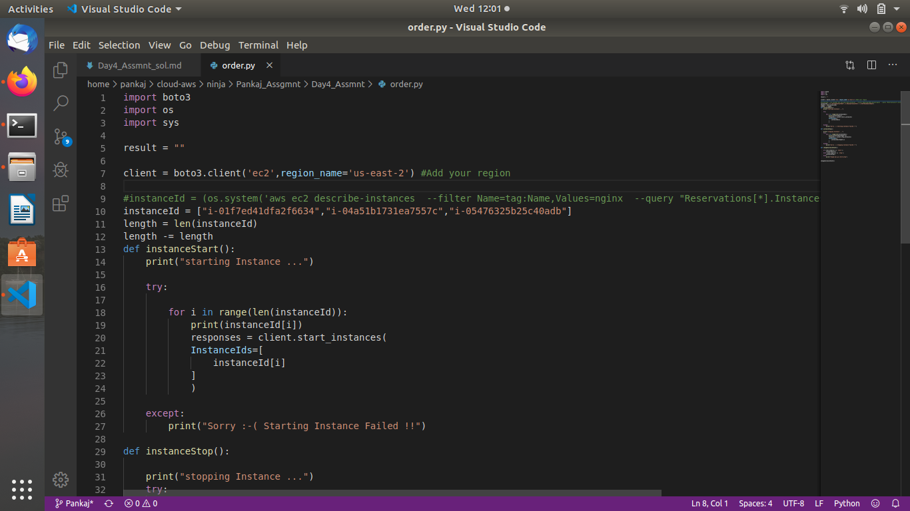

```
Now trying to starting instances with scripts
```

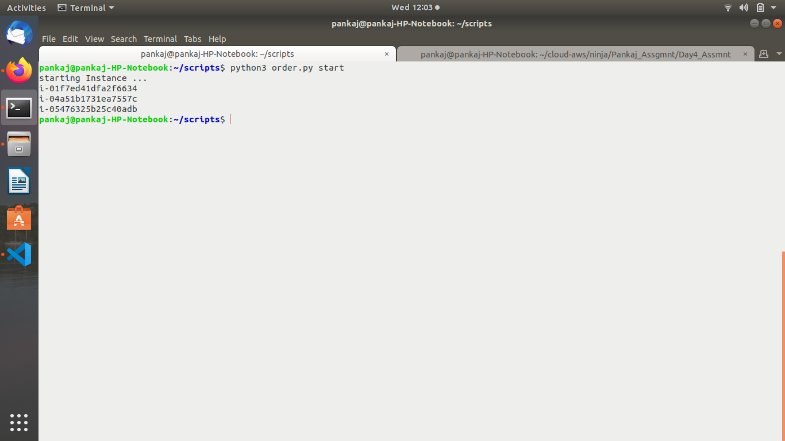

```
instances started 
```

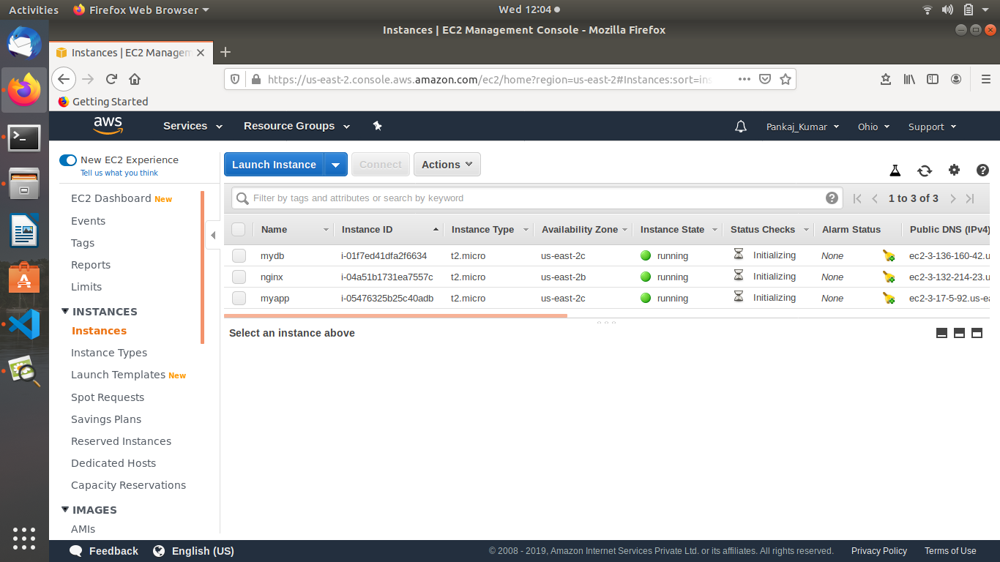

```
Now trying to stop instances accordingly
```
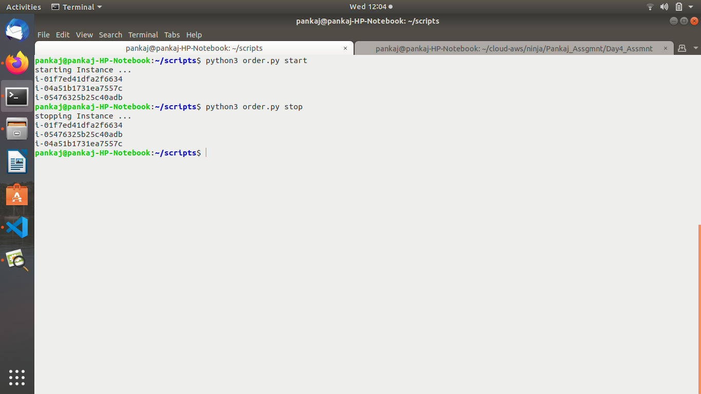

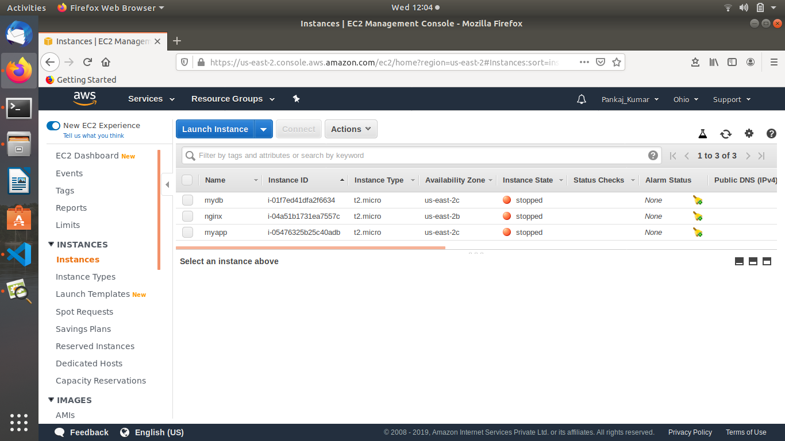


Task 3

Launch an ec2 instance with user-data having ansible role to host a website - [like previous assignment]

Figure out a way to launch this instance in your friend's AWS account

```
After launching instance with user-data as previous assignment, we have to create an image which another friend can use
```
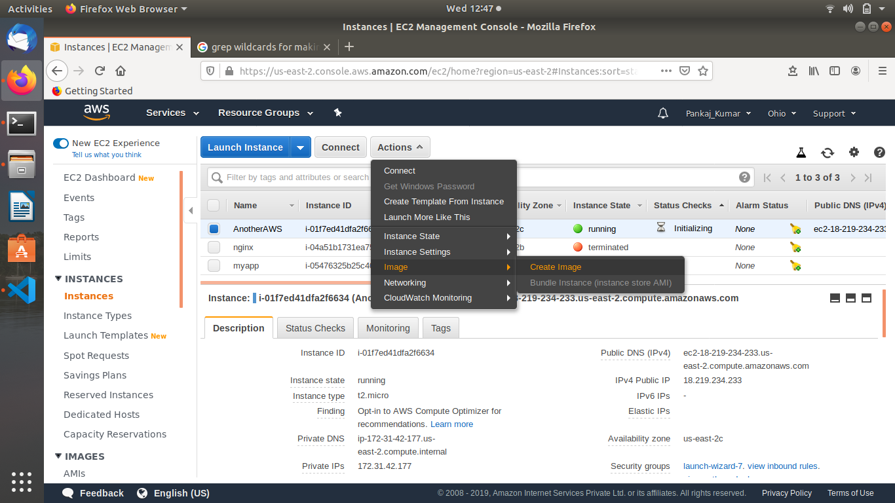

```
Add image name and description 
```

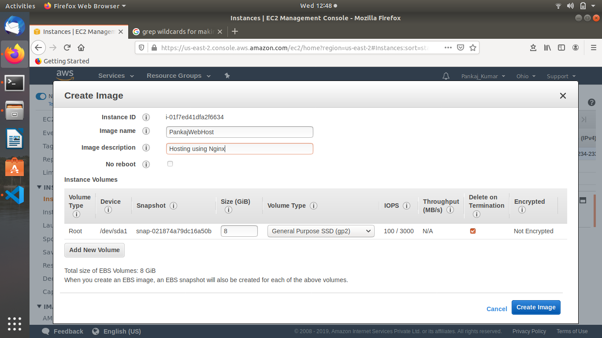

```
Now we have to mdify AMI permission so that someone else can use it 
```
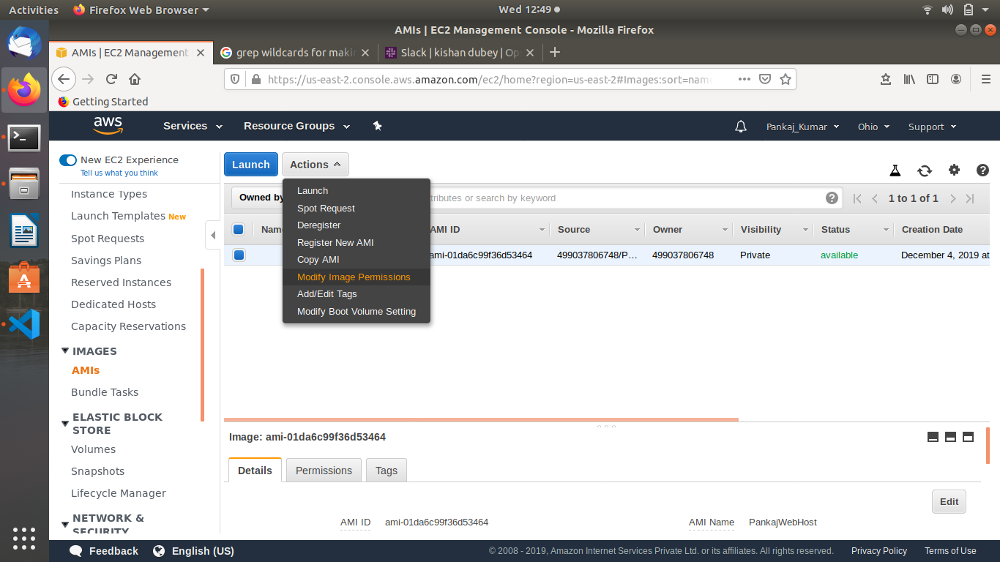

```
Now provide friend's AWS account number 
```

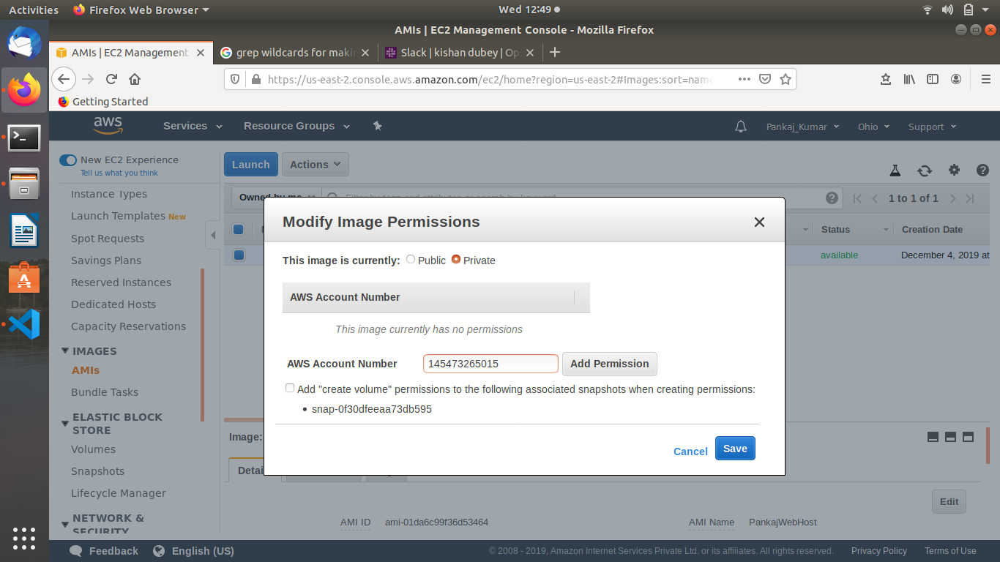

```
Now he will be able to use your AMI in his account
```
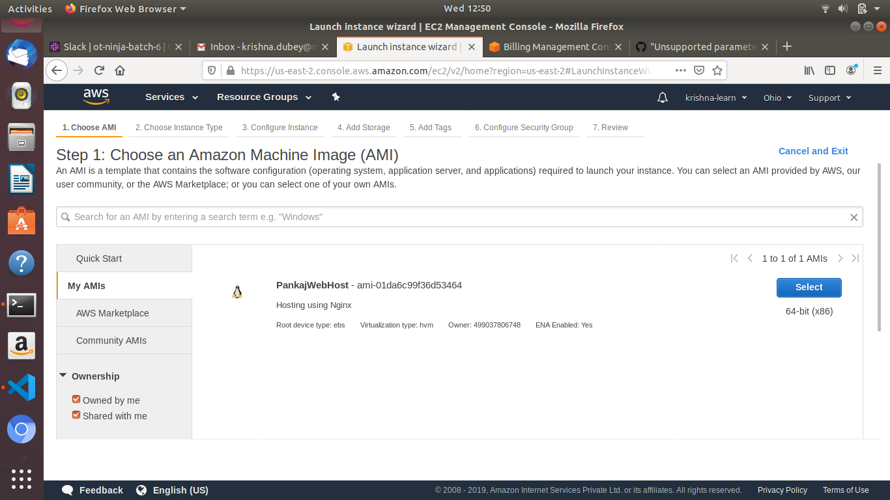

```
Now he can launch this instance in his account
```
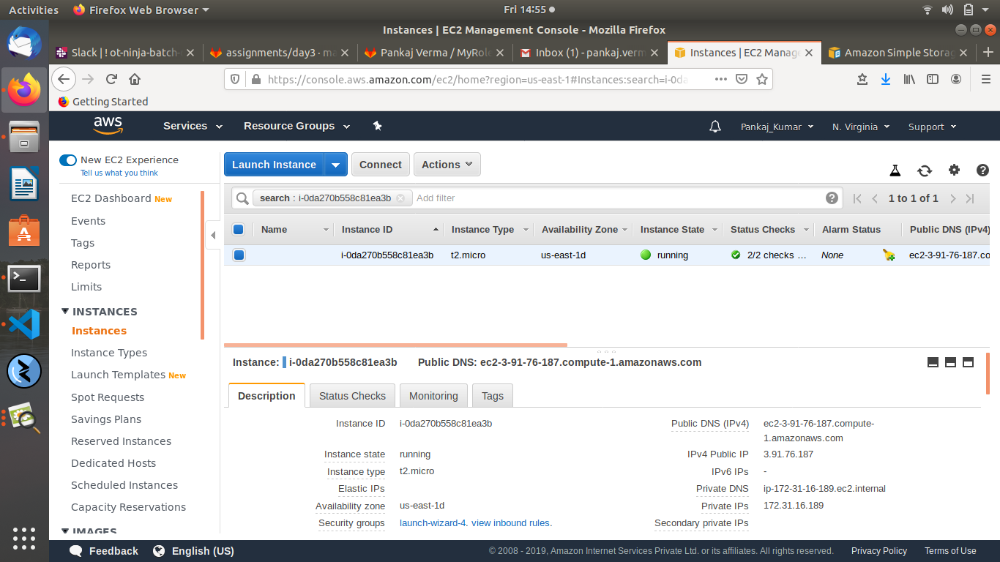

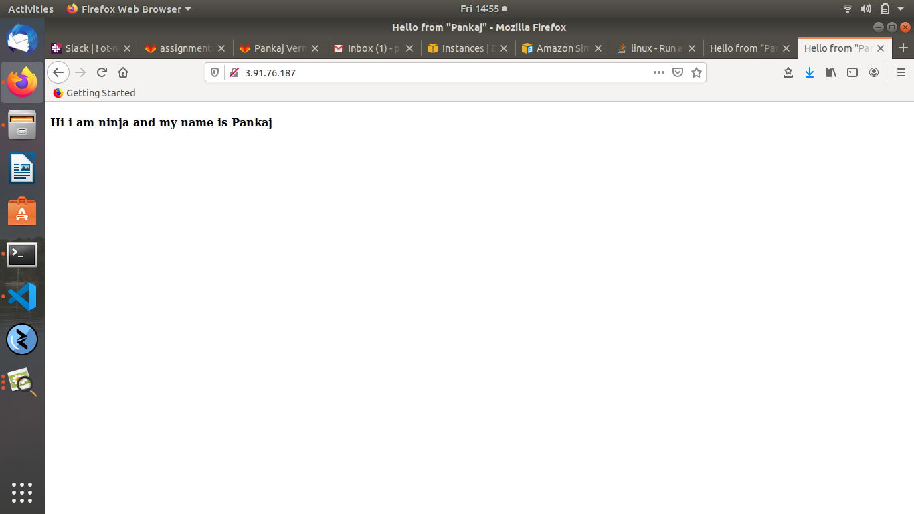

NOTE!

Make Documentation