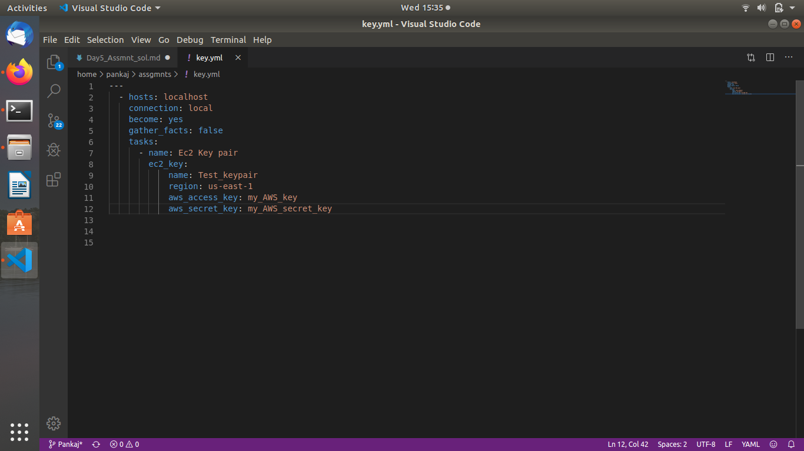
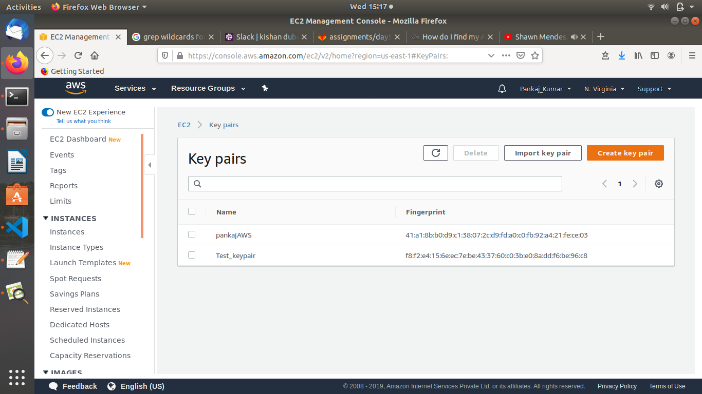
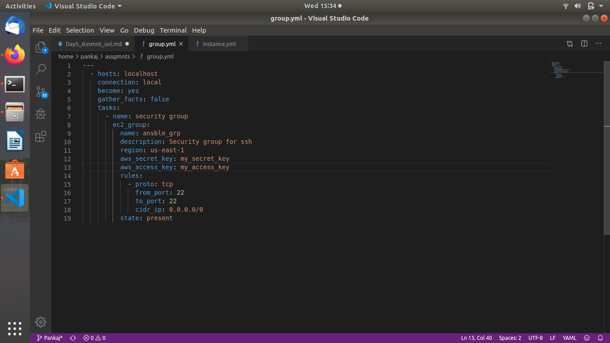
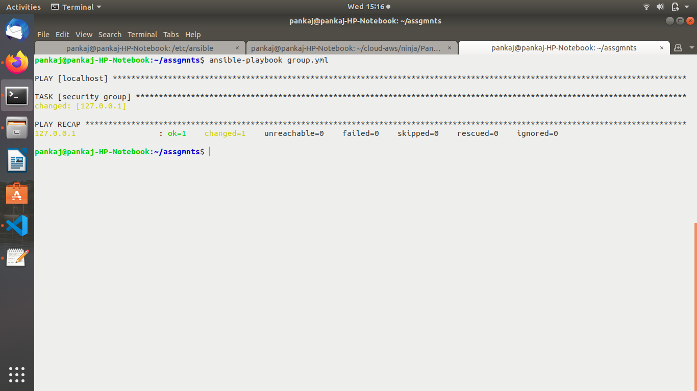
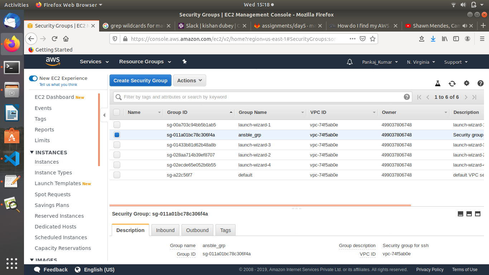
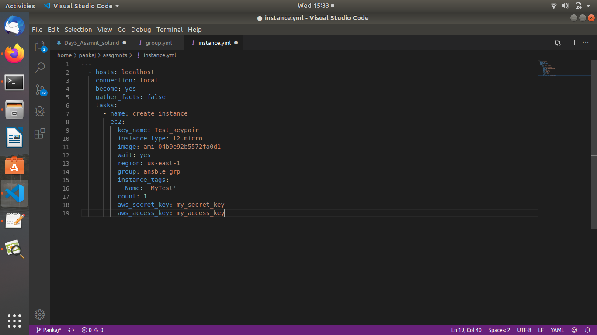
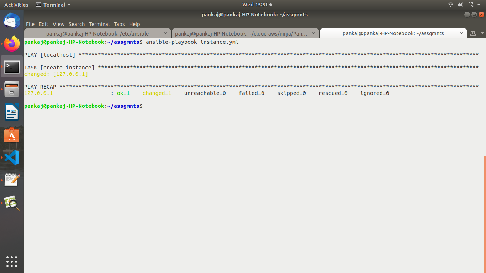
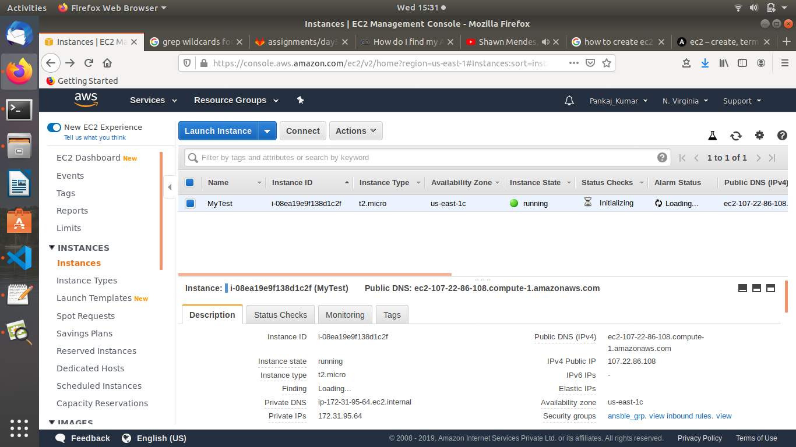

AWS Assignment Day-5


Task 1

Launch below infrastructure in your aws account using ansible's aws cloud modules

```
The below requirements are needed on the host that executes aws cloud module.
 python >= 2.6
 boto

Then we can create key-pair, security group, and ec2 instances using ansible....

```
create a key pair using ansible






create one security group that would allow you to ssh into the instance







using the key that you created, launch an instance in default vpc of N.virginia region with tags of your choice







NOTE!

Make Documentation
