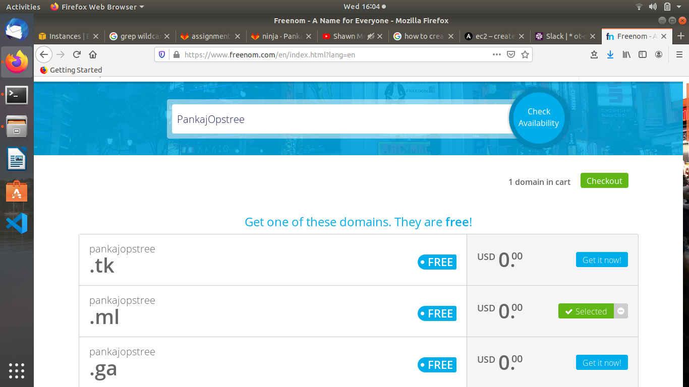

Task 1

Host a static website using s3 as follows:

Buy a domain from Freenom as yourname.opstree.com
 example: yashvinderopstree.com (Don't worry it's free)

```
Open your freenom account and check availibilty of your domain name
Then select domain of your choice (.tk, .ml etc)
```


```
Now register your domain
```


Migrate this domain to Route53
```
Now navigate to AWS Route53 service and select Create hosted zone in DNS management fill details accordingly
```


```
Now manage the nameservers in freenom accordingly
```


Host a static website using s3 bucket

```
Now create a S3 bucket same name as your domain name
```


```
enable it for static hosting
```


```
Attach your bucket in Route53
```


```
Now check in few minutes your website will be hosted
```


link for website

http://pankajopstree.ml/

NOTE!

Make Documentation