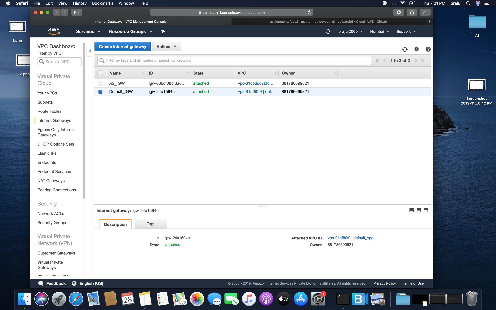

# AWS Assignment Day-2 Solution

## Task 1
> Create a vpc not by wizard this time but manually, having 2 public subnets and 2 private subnets and 2 protected subnets.

	In order to create a vpc manually, go to VPC's Dashboard & click on create VPC. Enter your desired VPC's name & give a proper CIDR block.

Note: Make sure to give a proper tag to everything you create.

	Now, we have to create 6 subnets in this VPC. 2 public, 2 private & 2 protected.

	Checkout to Create subnet Tab, and create your subnets. For high avail, make sure to create subnets in different zones.

> setup should be highly available

> Create 1 IGW and 2 NGW in each availability zone and make the appropriate routes in route tables

	Checkout to Internet Gateway, and create internet gateway for your Public Subnets.

	Checkout to NAT Gateway, & create 2 NAT's for your each Private Subnets. Also, remember NAT uses EIP.

	
	Now, we have to create the Routing tables for respevtive NAT's. So, for that checkout Routing Tables & create RT's

> Main route will remain intact, instead make 4 route tables
 - public_route_table
 - private_route_table_1
 - private_route_table_2 
 - protected_route_table

## Task 2

> Make LAMP setup with 2 instances in each private subnets. 

For creating LAMP stack, launch a Bastion Host (Jump Server) in both Public Subnets. 

Also, launch 2 instances in both Private subnets for python-based application.

We will configure our apache in Private subnet Instances.

Finally, create one instance each in both Protected subnets, we have installed mysql database in both of them.

> Server-1 should serve a webpage that would say "Hi! i am server 1"

 

> Server-2 should serve a webpage that would say "Hi! i am server 2"

### Task 3
> Launch a public load balancer that would forward the requests to these 2 LAMP instances

> create the same setup using aws-cli except vpc

#  NOTE!
  - Machines in the protected subnets shouldn't be going to internet and vice versa (verify this by launching an instance in this subnet)
  - Make Documentation and push to the repo
  - Make sure you copy the actual logs in the documentation rather than assuming that we'll get it `We know nothing`

