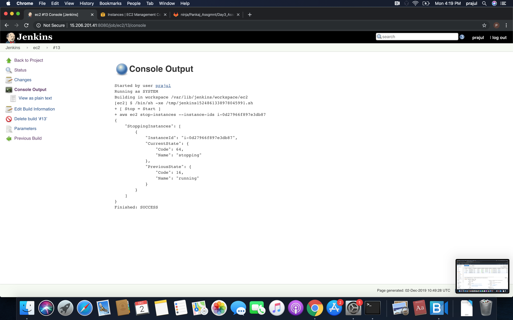

# AWS Assignment Day-3

## Task 1
> Create a linux t2.micro ec2 instance. After logging into this instance move /etc/sudoers file with /etc/sudoers.bkp 

	Launch a t2.micro instance and connect to it on starting. Move sudoers to .bkp and exit the instance. Again try to connect the instance and you will see, you can connect to it.

> Now try to login, If can't - resolve this issue

## Task 2

> create an ansible role before pushing the same to your public github repository.

	Role is created & pushed to repo. 

> This Role will simply host an nginx webpage saying
  - "Hi i am ninja and my name is {yourname}" 

> Execute this role in user data script while launching another instance

> Your website should be up & running after the system boots up
> tag this instance as `ninja:yourname`

### Task 3
> write a jobDsl to start stop this instance through jenkins  

#  NOTE!
  - Make Documentation
  - Don't commit and push your AWS Keys on any public repository
  
   

