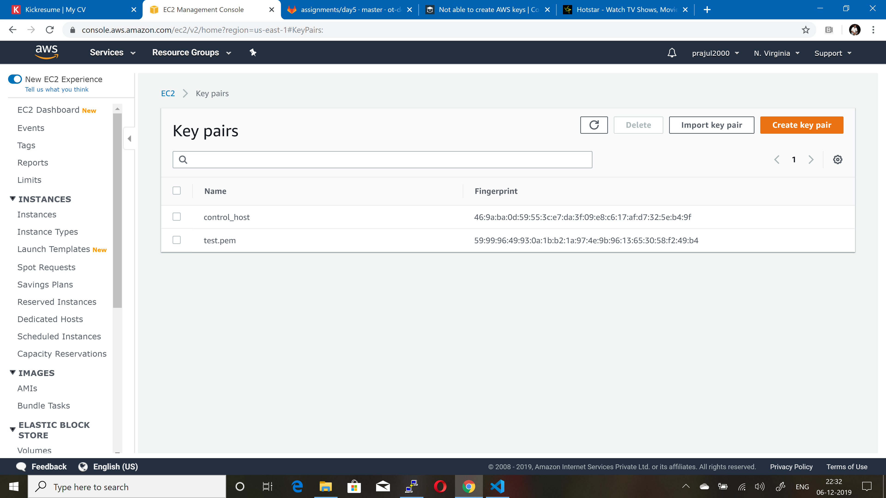
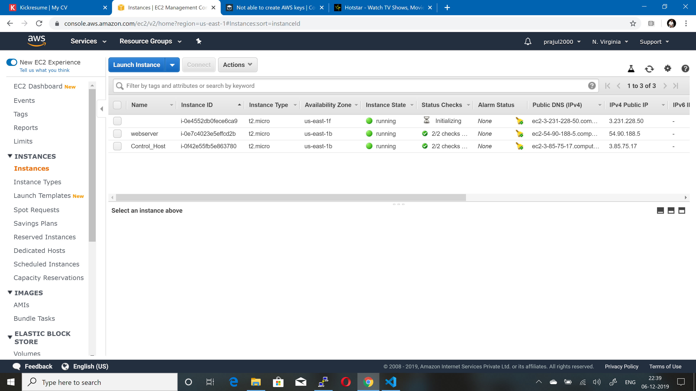
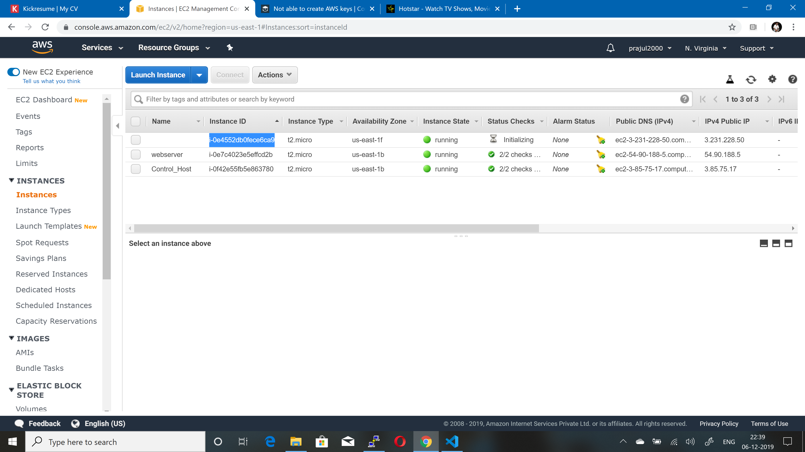

# AWS Assignment Day-5
 

### Task 1
> Launch below infrastructure in your aws account using `ansible's aws cloud modules`
  - create a key pair using ansible
  - create one security group that would allow you to ssh into the instance
  - using the key that you created, launch an instance in default vpc of N.virginia region with tags of your choice

#  NOTE!
  - Make Documentation

### Optional

  - Apply nginx role to the instance using dynamic inventory
