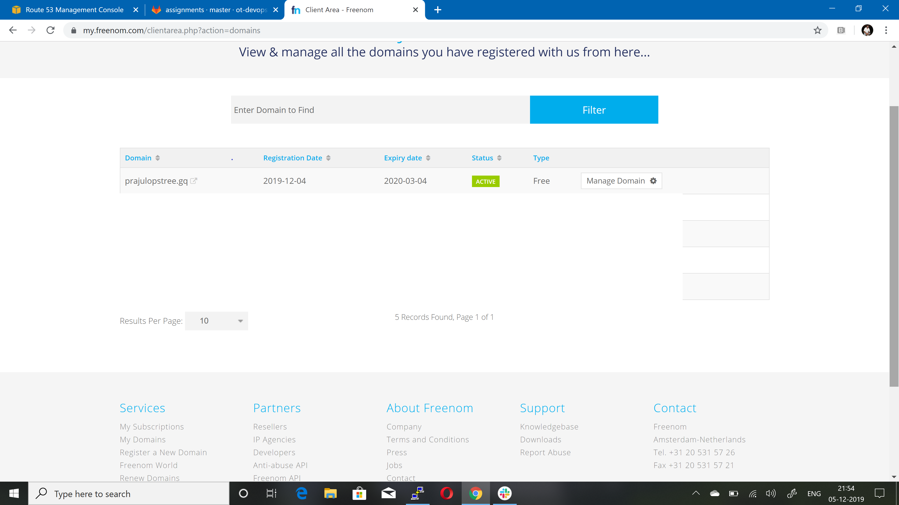
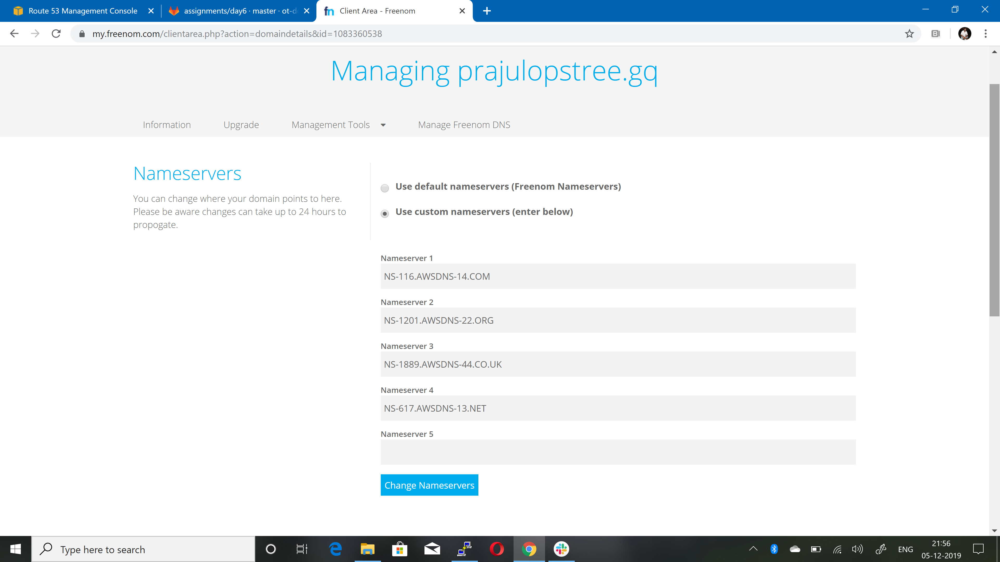
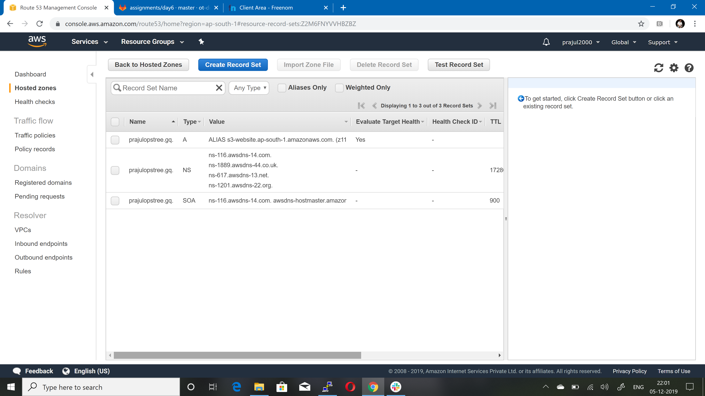
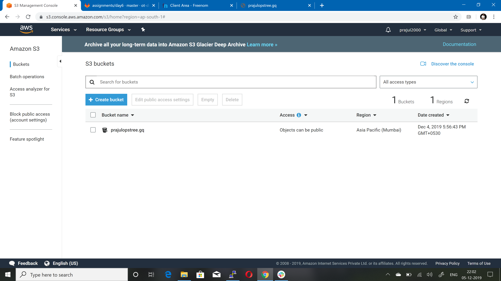
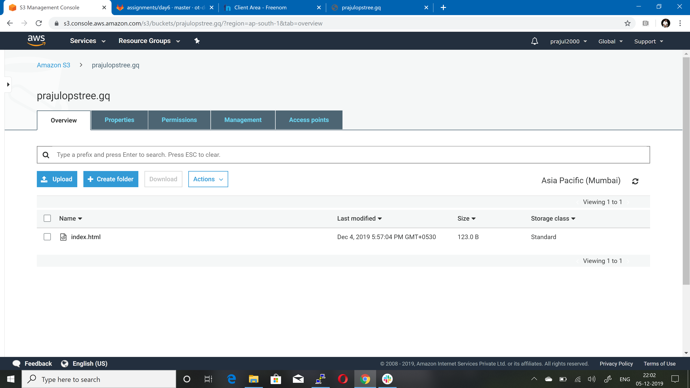
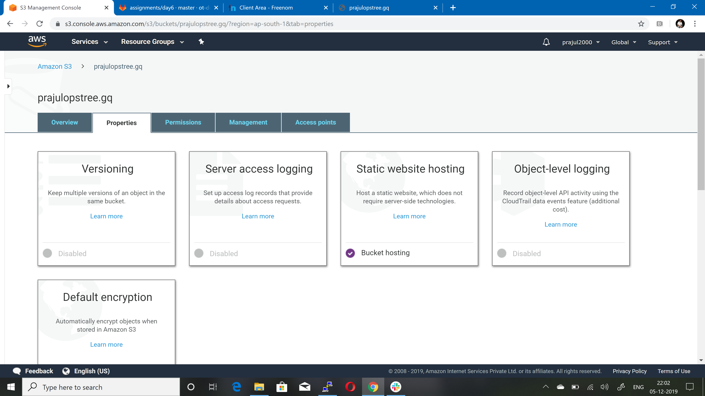
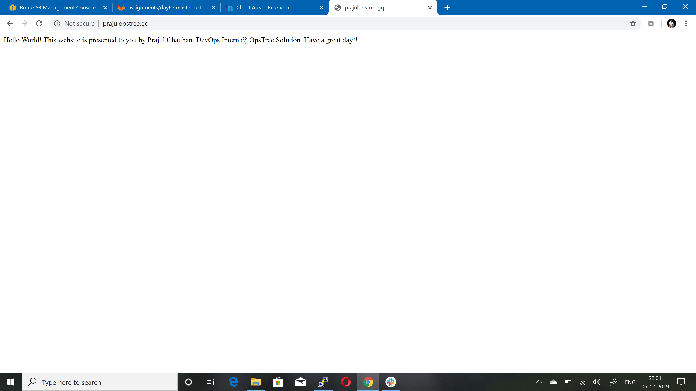

# AWS Assignment Day-5
 
[](https://nodesource.com/products/nsolid)


### Task 1
> Host a static website using s3 as follows:
  - Buy a domain from [Freenom](http://www.freenom.com) as `yourname`.opstree.com











  ```sh
   example: yashvinderopstree.com (Don't worry it's free)
  ```  
  - Migrate this domain to Route53
  - Host a static website using s3 bucket













#  NOTE!
  - Make Documentation

