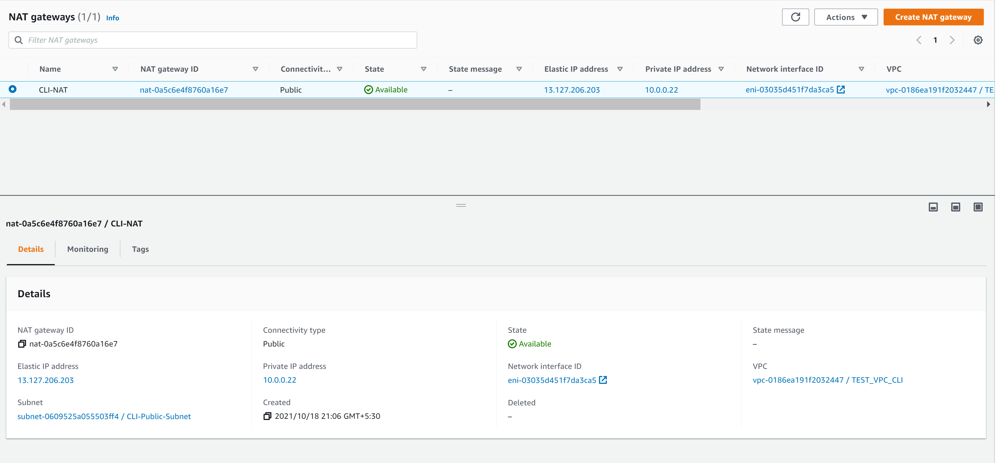
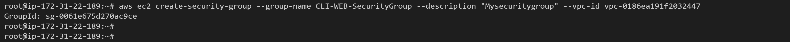
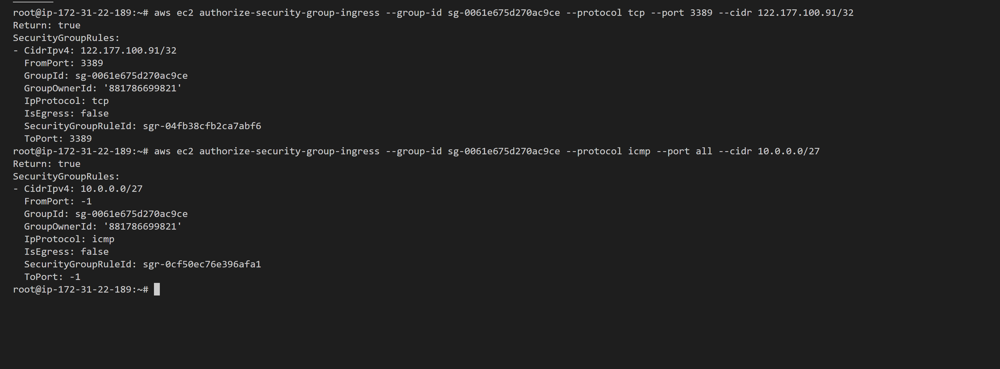

# AWS Assignment Day-1 Solution

### Task 1

> Create a vpc through wizard, having one public subnet and one private subnet.

### Task 2

> Create two instances within the vpc that you created in task 1, windows instance in public subnet and linux instance in private subnet. Check if linux is pingable from windows.
For vice versa, make linux instance public & windows instance private then ping it too windows instance from Linux instance. 

PS: Create a Bastion Host in Public Subnet

### Task 3

> Delete all the instances and now make those two instances that you created in previous task using aws-cli.


**USING AWS-CLI**


1. Creating VPC

```
aws ec2 create-vpc --cidr-block 10.0.0.0/26
```


2. Setting Tags for VPC

```
aws ec2 create-tags --resources vpc-0186ea191f2032447 --tags Key=Name,Value=TEST_VPC_CLI
```


#### Output 


3. Modifying VPC Attributes for enabling DNS Hostname

```
aws ec2 modify-vpc-attribute --vpc-id vpc-0186ea191f2032447 --enable-dns-hostname "{\"Value\":true}"
```


#### Output


4. Creating Public Subnet

```
aws ec2 create-subnet --vpc-id vpc-0186ea191f2032447 --cidr-block 10.0.0.0/27
```


5. Tagging Public Subnet

```
aws ec2 create-tags --resources subnet-0609525a055503ff4 --tags Key=Name,Value=CLI-Public-Subnet
```


#### Output


6. Enable auto-assign Public IP on the Public Subnet

```
aws ec2 modify-subnet-attribute --subnet-id subnet-0609525a055503ff4 --map-public-ip-on-launch
```


#### Output


7. Creating Private Subnet

```
aws ec2 create-subnet --vpc-id vpc-0186ea191f2032447 --cidr-block 10.0.0.32/27
```


8. Tagging Private Subnet

```
aws ec2 create-tags --resources subnet-06aa7f597b99617a3 --tags Key=Name,Value=CLI-Private-Subnet
```


#### Output


9. Create Internet Gateway

```
aws ec2 create-internet-gateway
```


10. Tagging Internet Gateway

```
aws ec2 create-tags --resources igw-02a74163f618830be --tags Key=Name,Value=CLI-IG
```


#### Output


11. Attach Internet Gateway

```
aws ec2 attach-internet-gateway --internet-gateway-id igw-02a74163f618830be --vpc-id vpc-0186ea191f2032447
```


#### Output


12. Allocate Elastic IP

```
aws ec2 allocate-address --domain vpc
```


#### Output


13. Tagging Elastic IP

```
aws ec2 create-tags --resources eipalloc-0b51fe4a278417bb0 --tags Key=Name,Value=CLI-EIP
```


#### Output


14. Create a Nat-Gateway and place it in the Public Subnet

```
aws ec2 create-nat-gateway --subnet-id subnet-0609525a055503ff4 --allocation-id eipalloc-0b51fe4a278417bb0
```


#### Output


15. Tagging Nat-Gateway

```
aws ec2 create-tags --resources nat-0a5c6e4f8760a16e7 --tags Key=Name,Value=CLI-NAT
```


#### Output




16. Create Route Table 1 for Public Subnet

```
aws ec2 create-route-table --vpc-id vpc-0186ea191f2032447
```


17. Tagging Public RT

```
aws ec2 create-tags --resources rtb-0584a3ac1c717b616 --tags Key=Name,Value=CLI-PUBLIC_RT
```


#### Output


18. Create Route Table 2 for Private Subnet

```
aws ec2 create-route-table --vpc-id vpc-0186ea191f2032447
```


19. Tagging Private RT

```
aws ec2 create-tags --resources rtb-06e9a229134bdddcf --tags Key=Name,Value=CLI-PRIVATE_RT
```

#### Output


20. Create a Route to the Internet associating IG in Public Route Table

```
aws ec2 create-route --route-table-id rtb-0584a3ac1c717b616 --destination-cidr-block 0.0.0.0/0 --gateway-id igw-02a74163f618830be
```


#### Output


21. Create a Route to the Internet for Private Route Table via NAT

```
aws ec2 create-route --route-table-id rtb-06e9a229134bdddcf --destination-cidr-block 0.0.0.0/0 -- gateway-id nat-0a5c6e4f8760a16e7
```


#### Output


22. Associate Public Route Table to PublicSubnet

```
aws ec2 associate-route-table --route-table-id rtb-0584a3ac1c717b616 --subnet-id subnet-0609525a055503ff4
```


#### Output


23. Associate Private Route Table to PrivateSubnet

```
aws ec2 associate-route-table --route-table-id rtb-06e9a229134bdddcf --subnet-id subnet-06aa7f597b99617a3
```


#### Output


24. Create a Security Group for RDP, SSH & Ping

```
aws ec2 create-security-group --group-name CLI-WEB-SecurityGroup --description "Mysecuritygroup" --vpc-id vpc-0186ea191f2032447
```




25. Tagging your SG

```
aws ec2 create-tags --resources sg-0061e675d270ac9ce --tags Key=Name,Value=CLI_SECURITY_GROUP
```


26. Adding rules for RDP & another rule for ping/ICMP

```
aws ec2 authorize-security-group-ingress --group-id sg-0061e675d270ac9ce --protocol tcp --port 3389 --cidr 122.177.100.91/32
aws ec2 authorize-security-group-ingress --group-id sg-0061e675d270ac9ce --protocol icmp --port all --cidr 10.0.0.0/27
```



#### Output


27. Launch Windows EC2 instance in Public Subnet

```
aws ec2 run-instances --image-id ami-0e7d76dfc4fac48d6 --count 1 --instance-type t2.xlarge --key-name TEST-VPC --security-group-ids sg-0061e675d270ac9ce --subnet-id subnet-0609525a055503ff4 -- associate-public-ip-address
```


28. Tagging Windows Instance in Public Subnet

```
aws ec2 create-tags --resources i-04c01e4ae130d73a6 --tags Key=Name,Value=CLI_WINDOWS_INSTANCE
```


29. Launch Linux EC2 instance in Private Subnet

```
aws ec2 run-instances --image-id ami-0c1a7f89451184c8b --count 1 --instance-type t2.micro --key-name TEST-VPC --security-group-ids sg-0061e675d270ac9ce --subnet-id subnet-06aa7f597b99617a3
```


30. Tagging Linux Instance in Private Subnet

```
aws ec2 create-tags --resources i-0b202d746f54b83e6 --tags Key=Name,Value=CLI_LINUX_INSTANCE
```

#### Output


31. RDP to Windows Instance & ping your Linux Instance in Private Subnet

#### Output


