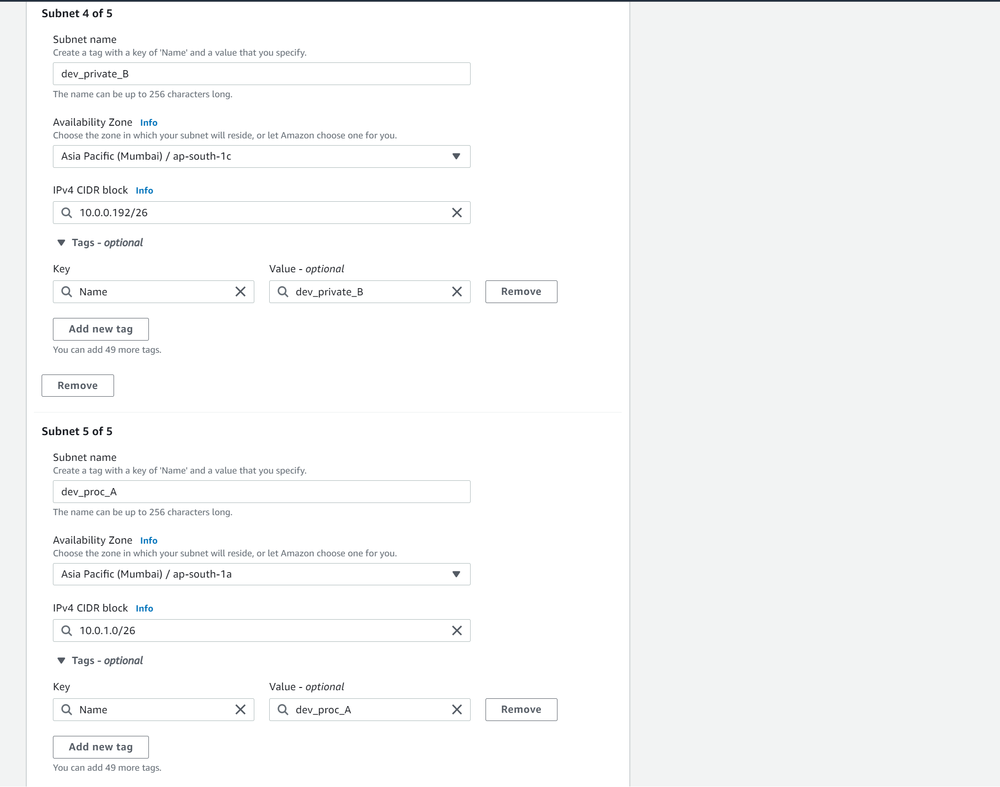

# AWS Assignment Day-2

### Task 1

> Create a vpc not by wizard this time but manually, having 2 public subnets and 2 private subnets and 2 protected subnets. Infrastructure should be highly available in atleast 2 AZ's.

> Create 1 IGW and 2 NGW in each availability zone and make the appropriate routes in route tables

> Main route will remain intact, instead make 5 route tables

 - public_route_table

 - private_route_table_1

 - private_route_table_2 

 - protected_route_table_1

 - protected_route_table_2

### Task 2

> Make LAMP setup with 2 instances as Webservers in each Private Subnets & Databases in Protected Subnets.

## For creating LAMP stack, follow the below steps:

> Create 2 Bastion Hosts (Jump Servers) each in both Public Subnets.
> Launch 2 Instances in both Private Subnets for your python-based application
> & install Apache (webserver) in them. You can refer to  Digital Ocean's blog regarding LAMP stack setup.

https://www.digitalocean.com/community/tutorials/how-to-install-linux-apache-mysql-php-lamp-stack-ubuntu-18-04

> Configure your apache in Private Subnet Instances.
>
> Finally, Launch one instance each in both Protected Subnets & install mysql database in both of them.

### Task 3

> Launch a public load balancer that would forward the requests to these 2 LAMP instances.

> Server-1 should serve a webpage that would say "Hi! i am server 1"
> Server-2 should serve a webpage that would say "Hi! i am server 2"
