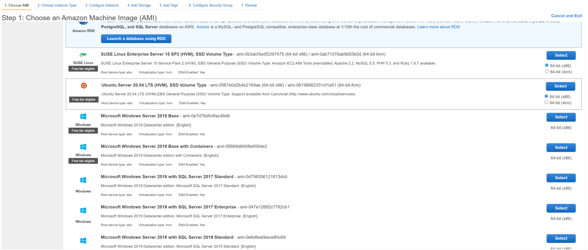
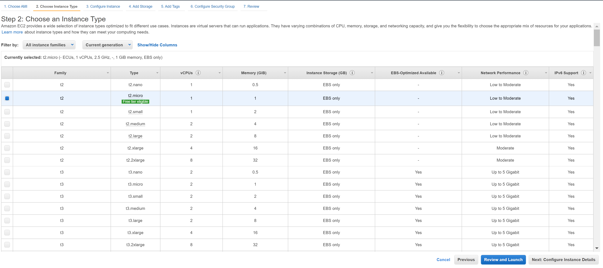
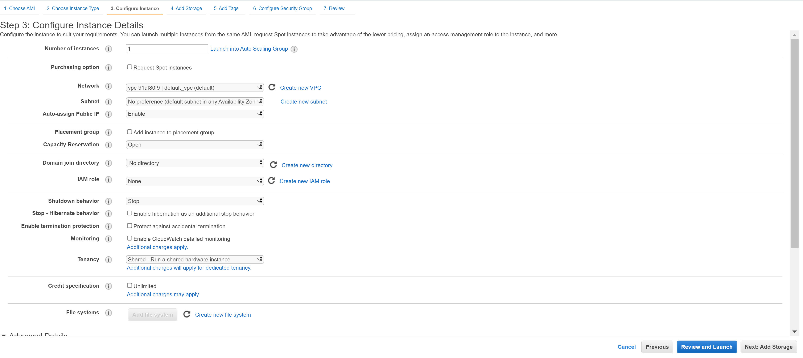
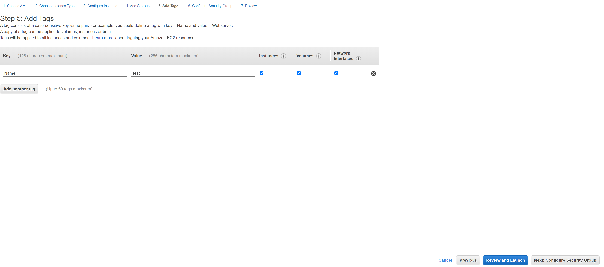
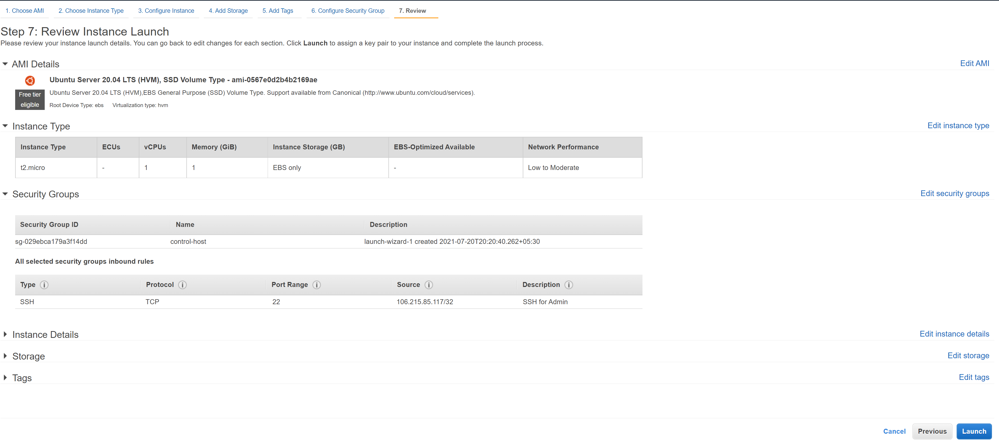
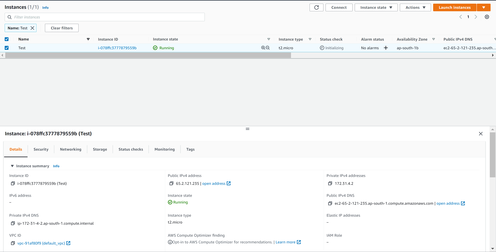
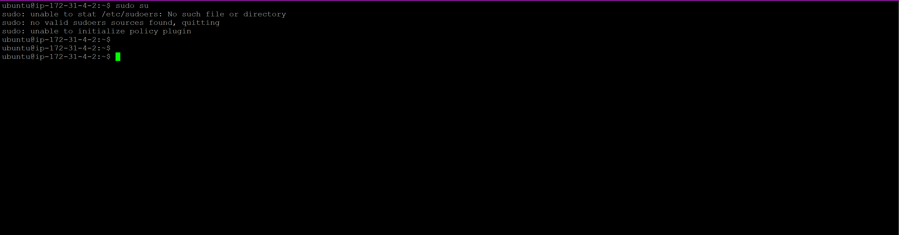

# AWS Assignment Day-3


### Task 1

> Create a linux t2.micro ec2 instance. After logging into this instance move /etc/sudoers file with /etc/sudoers.bkp 




















```Login to "TEST" instance & move /etc/sudoers file & try to switch to root user.```


> Now try to login, If can't - resolve this issue





```In order to resolve this, we need to the following steps:

* Stop the running 'TEST' instance & detach the volume associated with it.

```

### Task 2
> create an ansible role before pushing the same to your public github repository.

> This Role will simply host an nginx webpage saying
  - "Hi i am ninja and my name is {yourname}" 

> Execute this role in user data script while launching another instance

> Your website should be up & running after the system boots up

> tag this instance as `ninja:yourname`

### Task 3
> write a jobDsl to start stop this instance through jenkins  

#  NOTE!
  - Make Documentation
  - Don't commit and push your AWS Keys on any public repository
  
   

