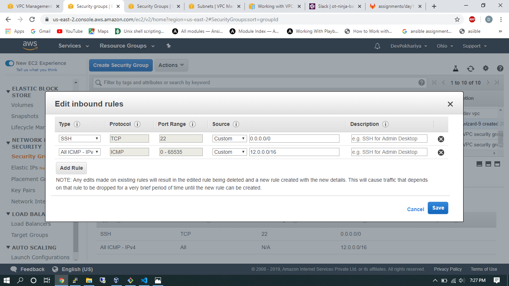

# AWS Assignment Day-1

[](https://nodesource.com/products/nsolid)


### Task 1
> Create a vpc through wizard, having one public subnet and one private subnet.
 
 * You can create a VPC from VPC dashboard you will see the "LAUNCH VPC WIZARD" button at the top of the page
    Once You are in you will get these option
 
    
    Select the second as per task then select the network Id and subnet Cidr from this page  
 

 * After selecting the proper subnet and netwok id you will get (This step will atuomatically allocate a route table and internet gateway and NAT gateeway by default)

 

### Task 2
> Create two instances within the vpc that you created in task 1, windows instance in public subnet and linux instance in private subnet. check if linux is pingable from windows and vice versa.


 * Create Two instance from Ec2 dashoard one linux and select VPC which you have created from Wizard also Make sure you choose public subnet for windows (i.e, public Instance) and do not forge to make the security group. 

  

 * Finally You will have 2 Instances with different subnet (Public and Private)

  

 * Now One Important thing you will have to do before doing ping it to update your security group rules as below

    
    (this is your windows inbound security group rules)

    Linux Private Security Group 

    


 * Connect to the window through RDP client software

 
    (You will get a public ip I a showing you private Ip here ) 😃

* Now once you are in RDP You will get a windows OS environment and display

 


* Now open cmd in windows instance and ping your Linux Instance.


    Success !! 🤘
 
 * Next for vise-versa You need to make Linux instance public and windows private ( Create New Instances

 * Follow same procedure and if you want to create new VPC create or add new instances in previously added VPC in public and Private subnet Linux and windoews simultenously. 

 * One major thing you will have to achive before you can ping your private windows is by  wnabling inbound rule inside your new private windows server 
 * which can be done by creating a new windows instance in same VPC (In need to access rdp to your private windows instance) 
 * Create new Windows instace in same VPC allowing rdp access from anywhere then access this new windows Instace from connect and using your RDP credentials

 * After successful connection you will be inside you public windows instance (call it Jump server)

 * Inside you Jump windows server open rdp and use your private windows credentials

 * In that enable the Ipv4 rule 
 
 
  * check the video for more info
   
    ```  https://www.youtube.com/watch?v=3XxQtZ2j4Mo ```

 * Once you have achived this correctly you will be able to ping the windows server

  

     P.s. I am using putty to ssh to my public instance

### Task 3
> Delete all the instances and now make those two instances that you created in previous task using aws-cli.

  * After deleting you have to install aws cli in your system
  
  * configure aws on your system {aws configure}

  ``` 
      aws ec2 run-instances --image-id {os image id}  --count 2 --instance-type t2.micro --associate-public-ip-address --key-name {Key pair name} --security-group-ids {Security gp name} --subnet-id {Subnet id} --region us-east-2

  ```
  (Change the names in braces {} )

   

   * Now add tag name

      ```
         aws ec2 create-tags --resources {instance id} --tags Key=Name,Value=Dev_From_CLi

      ```

      

#  NOTE!
  - Make Documentation and push to the repo

