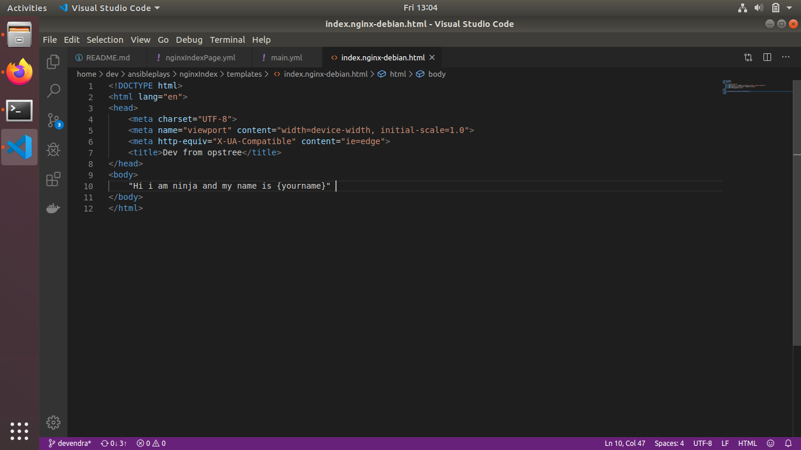
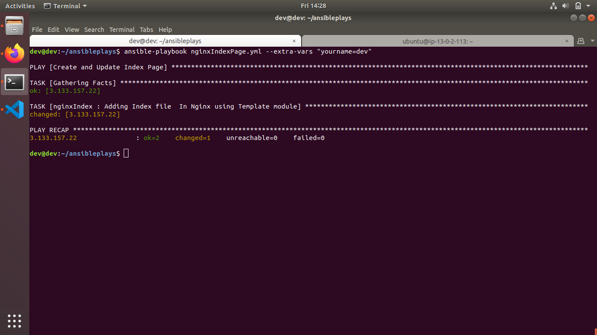
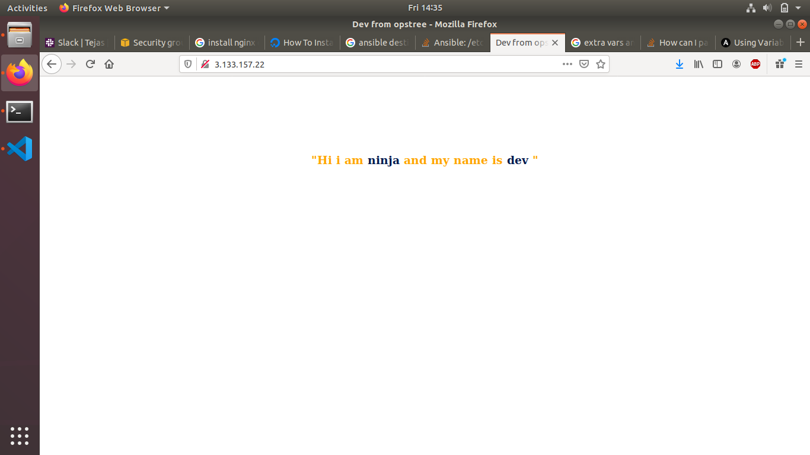
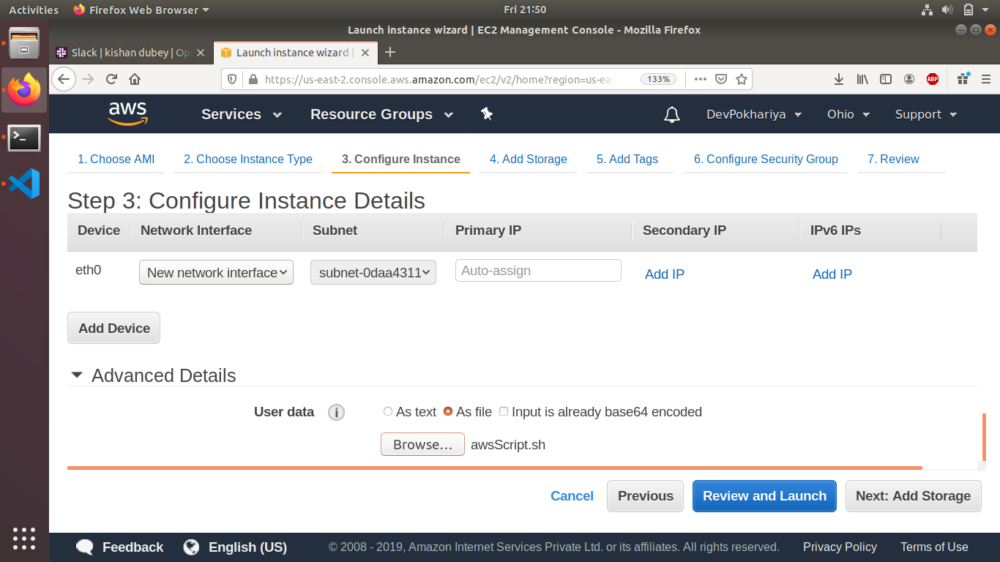
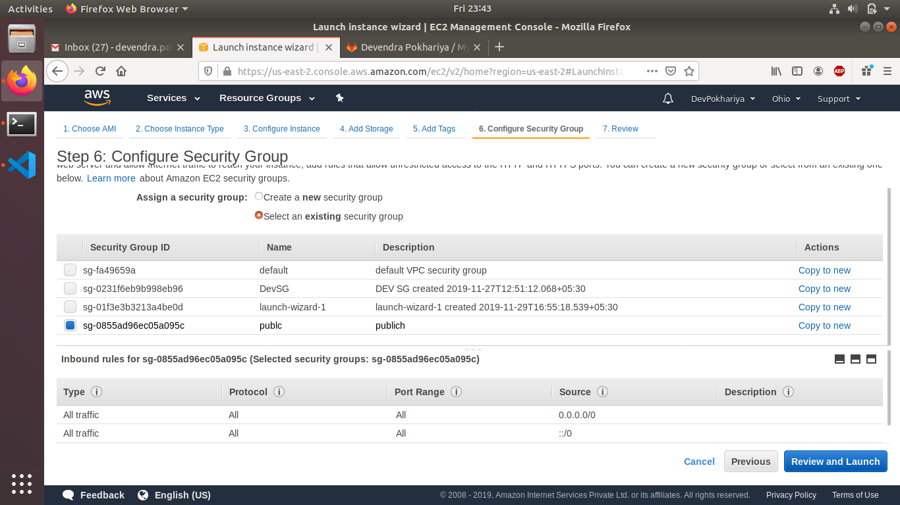
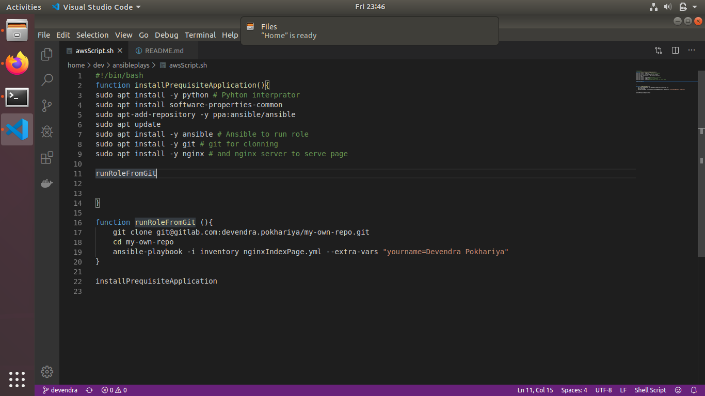
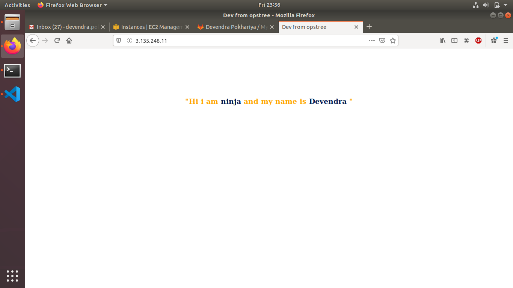
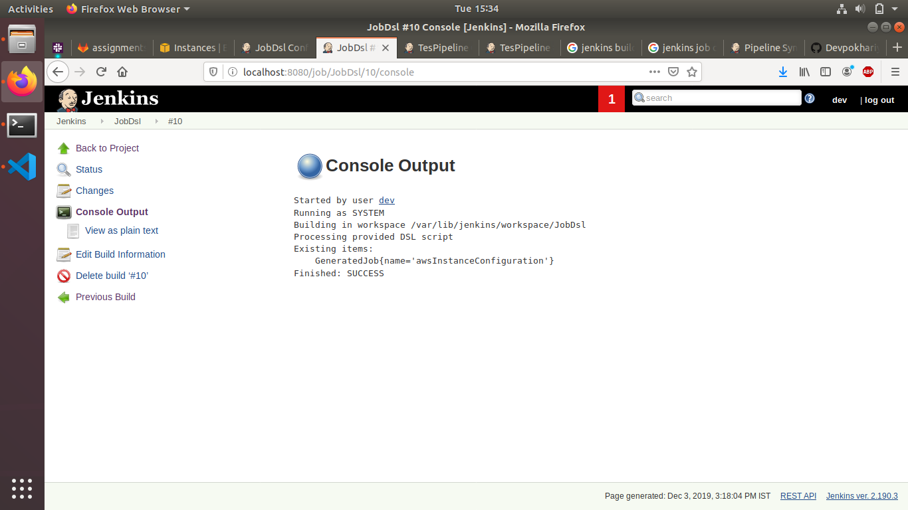
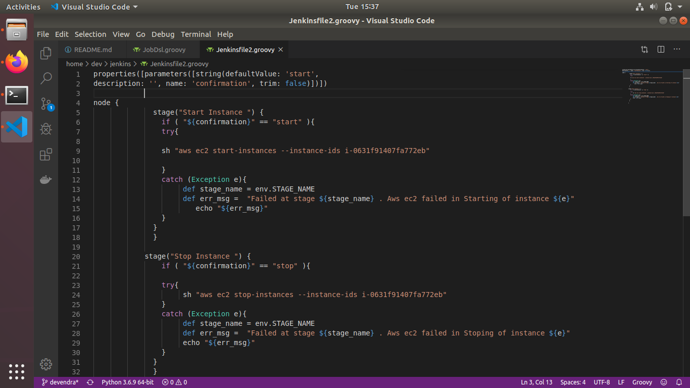
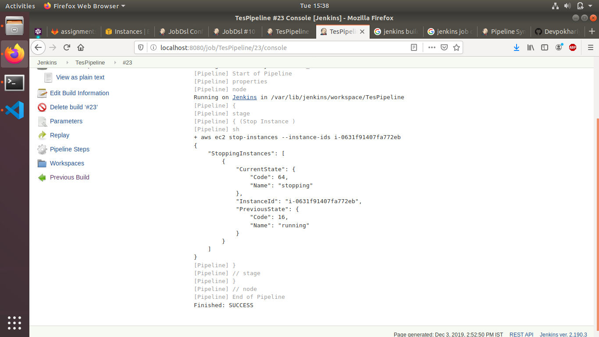

# AWS Assignment Day-3

[](https://nodesource.com/products/nsolid)


### Task 1
> Create a linux t2.micro ec2 instance. After logging into this instance move /etc/sudoers file with /etc/sudoers.bkp 

``` 
    ssh -i your.pem ubuntu@ip 
    mv /etc/sudoers /etc/sudoers.bk
```

> Now try to login, If can't - resolve this issue

``` 
    ssh -i your.pem ubuntu@ip 
    
```
* Able To login successfuly

### Task 2
> create an ansible role before pushing the same to your public github repository.

```  
        ---
        # tasks file for nginxIndex
        - name: Adding Index file  In Nginx using Template module
          template: 
             src: index.nginx-debian.html.j2
             dest: /var/www/html/index.nginx-debian.html

```


> This Role will simply host an nginx webpage saying 
  - "Hi i am ninja and my name is {yourname}" 

  * for this write a simple html in your temlplate folder in j2 extension

  ``` 
                    
    <!DOCTYPE html>
    <html lang="en">
    <head>
        <meta charset="UTF-8">
        <meta name="viewport" content="width=device-width, initial-scale=1.0">
        <meta http-equiv="X-UA-Compatible" content="ie=edge">
        <title>Dev from opstree</title>
    </head>
    <body style="text-align:center; margin:10%">
        <h3 style="color:orange">
        "Hi i am <span style="color:#031b4e">ninja</span> and my name is <span style="color:#031b4e">{{yourname}} </span>" 
        </h3>
    
    </body>
    </html>
    
  ```






 Bang !! you will see the output in below format 🤘

 


> Execute this role in user data script while launching another instance


* Choose add file option on user data



* your security group



* your shell script



> Your website should be up & running after the system boots up

* You will see the website is up and running 🤘



> tag this instance as `ninja:yourname`


### Task 3
> write a jobDsl to start stop this instance through jenkins  

 

 ```
 pipelineJob('awsInstanceConfiguration') {
    definition {
             cpsScm {
                 scriptPath 'Jenkinsfile'
                 scm {
                   git {
                       remote { url 'https://github.com/Devpokhariya/Jobdsl.git' }
                       branch '*/master'
                       extensions {}
                   }             }
         }
     }
  }

 ```
* Your Jenkins Script



* Console Output of Job




#  NOTE!
  - Make Documentation
  - Don't commit and push your AWS Keys on any public repository
  
   

