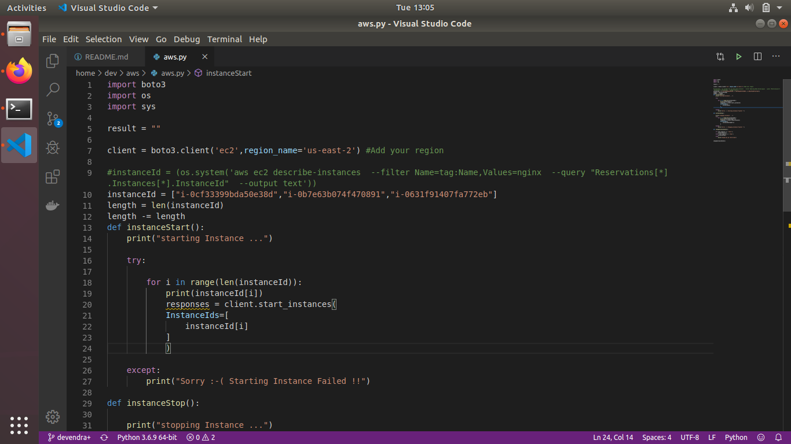
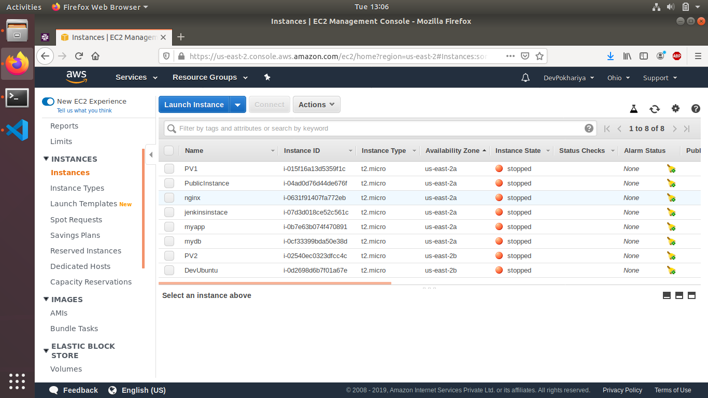
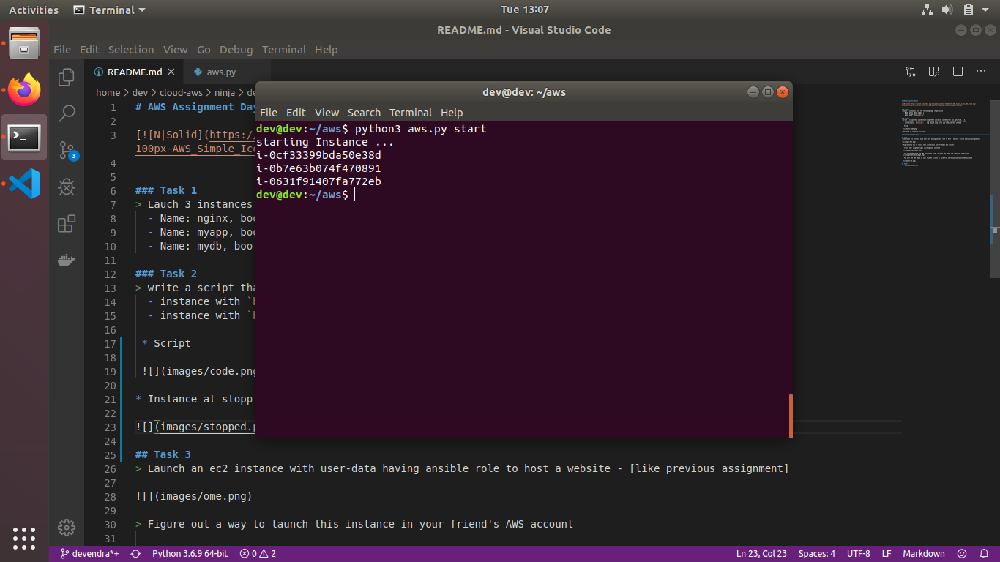
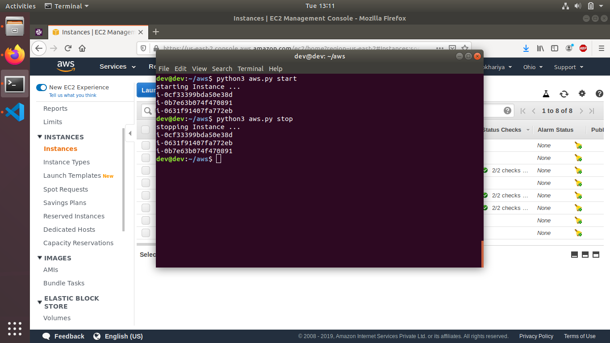
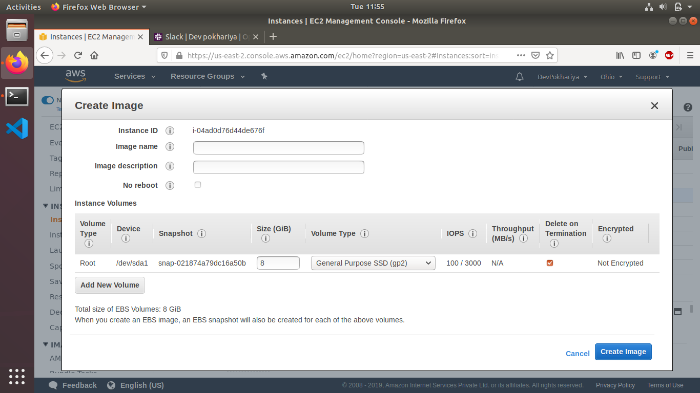
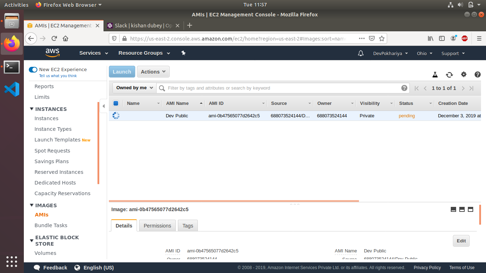
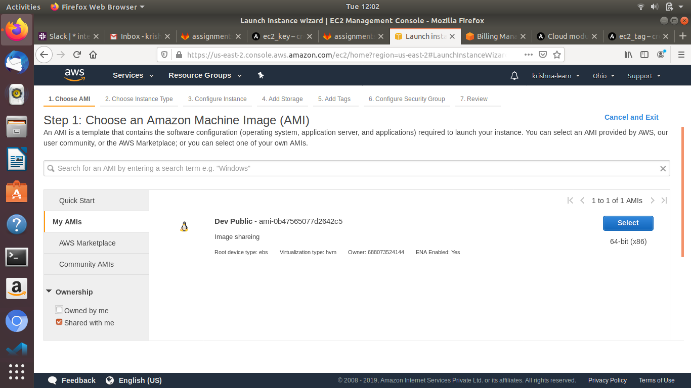

# AWS Assignment Day-4

### Task 1
> Lauch 3 instances with the following tags respectively
  - Name: nginx, boot-order: 1 
  - Name: myapp, boot-order: 2
  - Name: mydb, boot-order: 3 

### Task 2
> write a script that would start/stop these instances in the order you specified, i.e.
  - instance with `boot-order: 3` tag should boot/start first and likewise rest of them
  - instance with `boot-order: 1` tag should stop first and likewise rest of them
 
 * Script
 
 

* Instance at stopping position

* Starting Instance in sequence

* Instances got up and running Started 

* Stopping instence in reverse order

## Task 3
> Launch an ec2 instance with user-data having ansible role to host a website - [like previous assignment]  

> Figure out a way to launch this instance in your friend's AWS account

 * Create your image by right clicking your instance

 

 * now share the image fom AMI section by right clicking the image and "changing permission"
 
   
 * You will see the image in your friends account as such from where you can launch the instance
    
 

#  NOTE!
  - Make Documentation
  
   

