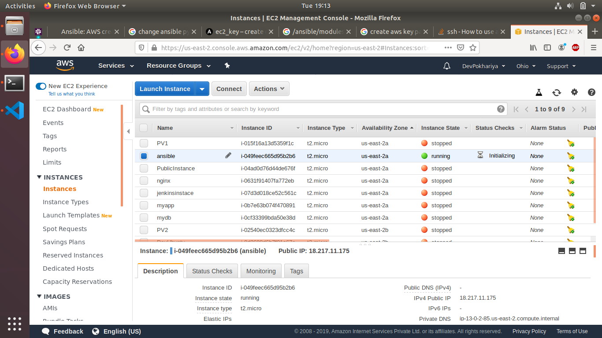

# AWS Assignment Day-5
 
[](https://nodesource.com/products/nsolid)


### Task 1
> Launch below infrastructuyre in your aws account using `ansible's aws cloud modules`
  - create a key pair using ansible
  
  ```
    ---
    - hosts: localhost
      connection: local
      become: yes
      gather_facts: false
      tasks: 
        - name: Ec2 Key pair 
          ec2_key:
              name: my_keypair
              region: us-east-2
              aws_secret_key: ******************
              aws_access_key: **************
  
  ```
  * successfull output
  

  * check if it is created

  

  - create one security group that would allow you to ssh into the instance

  ``` 

   - name: security group
        ec2_group:
          name: example
          description: example of ec2 group
          vpc_id: vpc-0b59e09043de9b8eb
          region: us-east-2
          aws_secret_key: ***
          aws_access_key: ******
          rules:
            - proto: tcp
              from_port: 80
              to_port: 80
              cidr_ip: 0.0.0.0/0
            - proto: tcp
              from_port: 22
              to_port: 22
              cidr_ip: 0.0.0.0/0
            - proto: tcp
              from_port: 443
              to_port: 443

  ```


  - using the key that you created, launch an instance in default vpc of N.virginia region with tags of your choice

  ``` 
    - name: create instance
        ec2: 
          instance_type: t2.micro
          image: ami-0d5d9d301c853a04a
          wait: yes
          group: example
          count: 1
          vpc_subnet_id: subnet-038bd9b45a3d0acbc
          assign_public_ip: yes       
          region: us-east-2
          aws_secret_key: ****
          aws_access_key: ******
  
  ```
  

  * Instance is up
  

#  NOTE!
  - Make Documentation

### Optional
  - Apply nginx role to the instance using dynamic inventory
