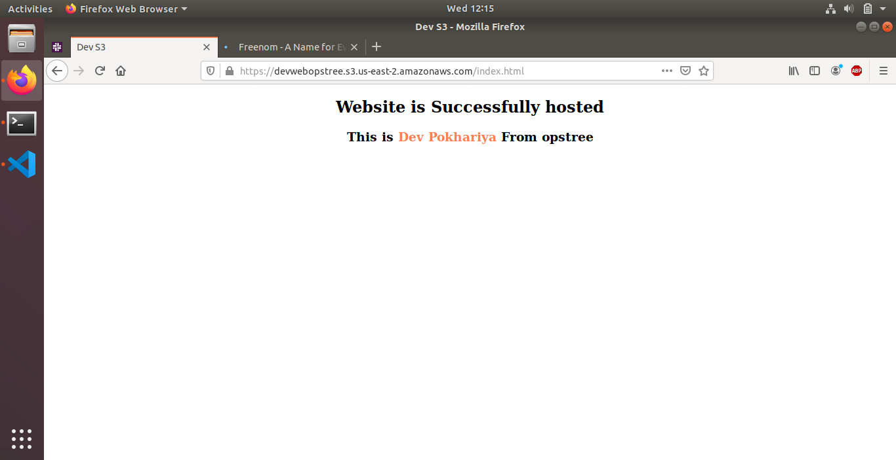
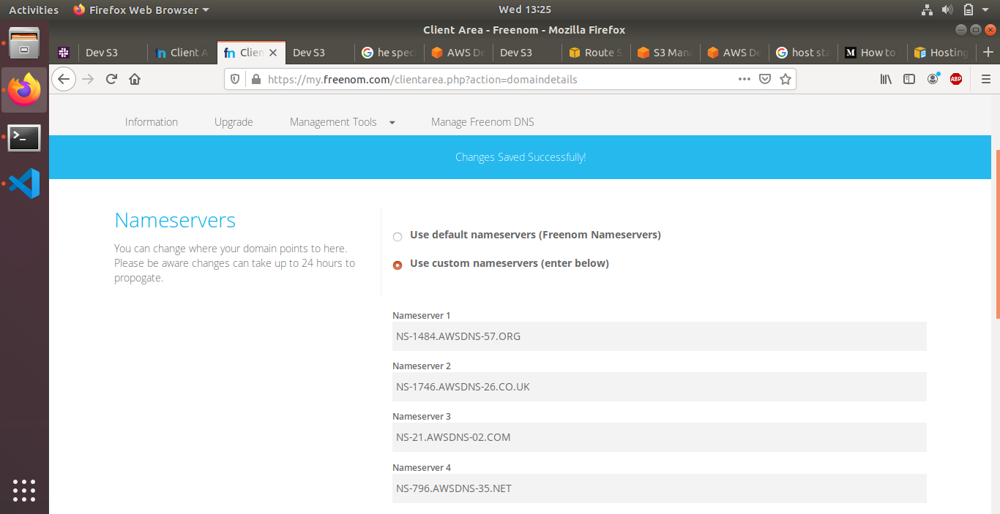
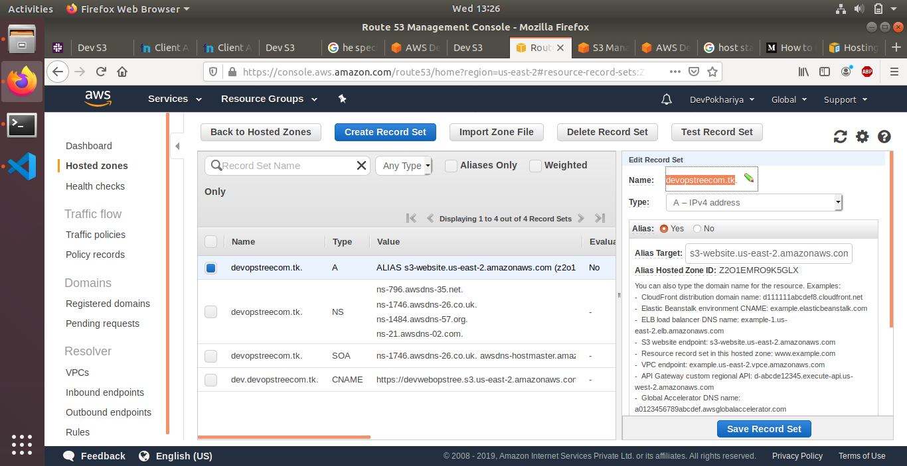
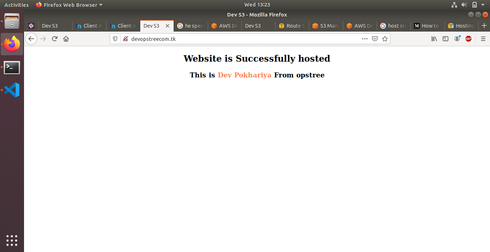

# AWS Assignment Day-5
 
[](https://nodesource.com/products/nsolid)


### Task 1
> Host a static website using s3 as follows:
  - Buy a domain from [Freenom](http://www.freenom.com) as `yourname`.opstree.com

  ```sh
   example: yashvinderopstree.com (Don't worry it's free)
  ```  

  
  - Migrate this domain to Route53

  * Add Name server to your freenome

  

  * add records in your Route53 

  

  - Host a static website using s3 bucket

  * Give it 2-5 minute to come live

  

 ``` Below is the website Url ```

  http://devopstreecom.tk/

 ( It should be working ) 👍
 
#  NOTE!
  - Make Documentation


